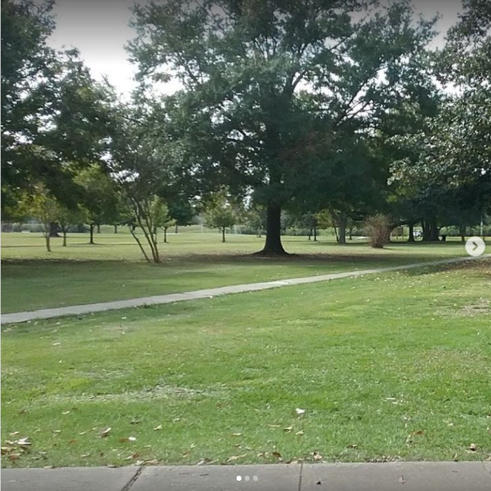
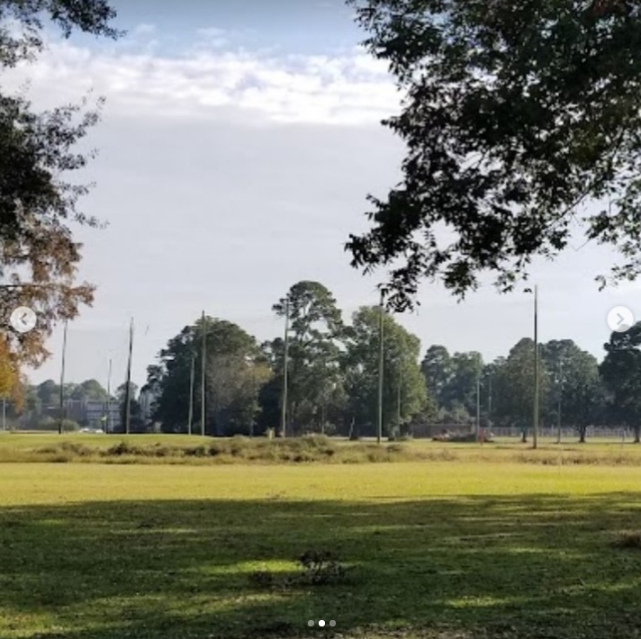
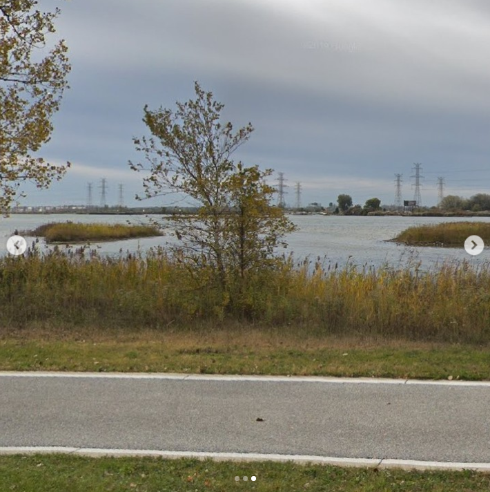
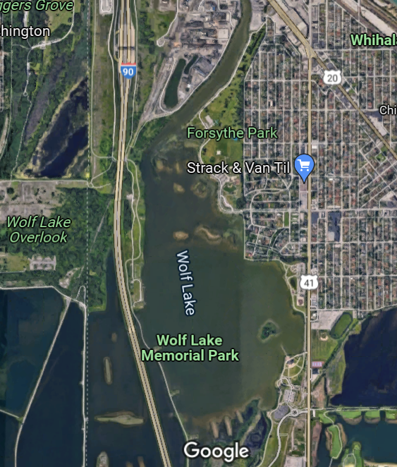
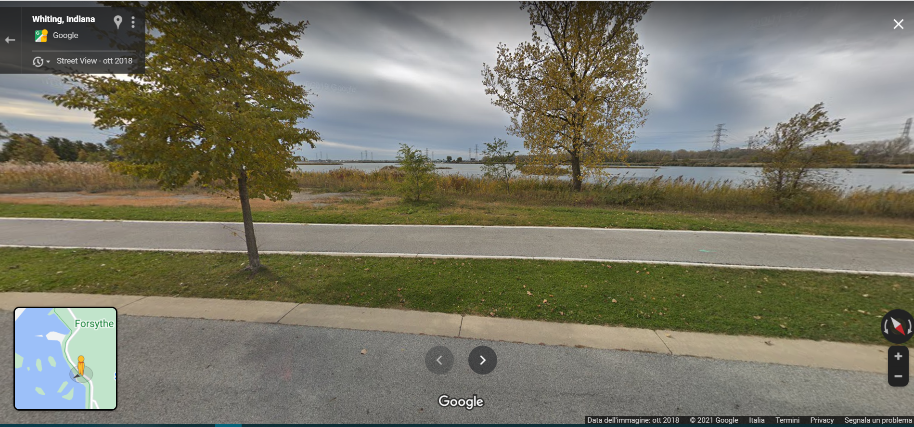

# MetaCTF CyberGames 2021 Write-ups
Event: **MetaCTF CyberGames 2021, 3-5 December 2021** | [official URL](https://metactf.com/cybergames)

Final position: **83th in Students-only Scoreboard, 174th in Global Scoreboard** | [Full Scoreboard here](https://ctftime.org/event/1476)

Our Team: **CangureTheFlat** | [CTFtime page](https://ctftime.org/team/137370)

Formed by: 
* [Gregorio Galletti](https://github.com/gregalletti)
* [Stefano Bagarin](https://github.com/stepolimi)

# Write Ups - Categories and Points
> We will list here just the most useful writeups for us, to better remember all the new knowledge learned.

## Cryptography

### Unbreakable Encryption
  

Ciphertext 1: 4fd098298db95b7f1bc205b0a6d8ac15f1f821d72fbfa979d1c2148a24feaafdee8d3108e8ce29c3ce1291

Plaintext 1: hey let's rob the bank at midnight tonight!

Ciphertext 2: 41d9806ec1b55c78258703be87ac9e06edb7369133b1d67ac0960d8632cfb7f2e7974e0ff3c536c1871b

### Company Picnic
  

We are given [this file](https://metaproblems.com/2c4d19e43f1a8c225fcd413bdebeaea2/public_keys.txt)

## Web

### WAS my flag? Part I
  

> https://metaproblems.com/327814c2aea7ea2c2e7969fb32d3ec47/

## Web

### WAS my flag? Part I
  

> https://metaproblems.com/327814c2aea7ea2c2e7969fb32d3ec47/

## Reversing

### I hate Python
  

> https://metaproblems.com/327814c2aea7ea2c2e7969fb32d3ec47/

## Recoinnassance

### I want my files back!
  

> https://metaproblems.com/a813fc7a6085f695ddb6ae1fd7658943/supercriticalfile.png.[AA4-MX4-GGQD]

### Mystery C2 Server
  

> https://metaproblems.com/a813fc7a6085f695ddb6ae1fd7658943/supercriticalfile.png.[AA4-MX4-GGQD]

## Other

### Interception I
  

> 192.168.0.1 is periodically (once every 4 seconds) sending the flag to 192.168.0.2 over UDP port 8000. Go get it.

> ssh ctf-1@host.cg21.metaproblems.com -p 7000

### Interception II
  

> Someone on this network is periodically sending the flag to ... someone else on this network, over TCP port 8000. Go get it.

> ssh ctf-46ed3559da08@host.cg21.metaproblems.com -p 7000

## Unsolved Challenges
Unfortunately, we did not manage to solve some challenges that were pretty feasible for us. Here I will put the writeups anyway because they may be helpful sooner or later.

### Tic Tac Toe 
  
**Reason of failure**: we are idiots

Flag: ****

### Pattern of Life
  
**Reason of failure**: we are idiots (again)

Flag: ****

### Source Code Shipping
  
**Reason of failure**: no time

Flag: ****

### Where's Vedder?
  
**Reason of failure**: no idea of US things, no time
> Please help find our dear friend Vedder Casyn. His last known location was this location. We believe it's within a public forest area in his home state.

> The answer should represent the MD5 hash of the address of the location.

I must say that, I was really close on this.

We know Vedder from the last year CTF, so we already know its social profiles [github](https://github.com/veddercasyn), [twitter](https://twitter.com/veddercasyn), [linkedin](https://www.linkedin.com/in/vedder-casyn/) and its [website](https://veddercasyn.me/).

From these we know that he lives in Hammond, Indiana. This is the crucial point, I focused on this challenge the last hour, and I lost a lot of time by searching for forests in Hammond. Not Indiana. I'm just dumb because the description says **home state**, but when I realized that it was too late.

However, we are given this location to search:


I had no clue of what the building on the left was, but then after A LOT of research I found out that US funeral homes look like this (actually cool), so this is what we want to search.

Then we can see another building on the left that may be useful to filter the funeral homes we find, and in front of that what seems a parking lot.

The last two things are the trees right behind the buildings (pretty high ones) and a street right in front of them. Nice, we can start by searching the public forests in Indiana (:expressionless:).  
This area must be big, there is no way they want us to search for all little parks in a whole state. This is why all my researches through public institutes websites is useless.

By just looking at the Satellite view in Google Maps we can see that the northern part of Indiana seems empty, while the southern one seems more promising (guess where I searched for all the time...).

I think that maybe now the fastest way is to search for funeral homes here, and filter out the ones that are not within a forest area (actually look for *more green* areas):


Look! Just one of the result is totally within a green area: Dembo Funeral Home.  
Let's zoom in and see if we are good:


Everything matches: the street, the trees, the parking lot and the buildings. The address is: `628 IN-64, English, IN 47118` that in MD5 is `7be0798af71f79eadb9254d3554aa301`.

This was a really good challenge overall, but I can't help hating Mr. Casyn for all he did to me.

Flag: **7be0798af71f79eadb9254d3554aa301**

### Online Presence
  
**Reason of failure**: no time
> Sources say Vedder may have used Reddit the past two weeks. It would make sense for him to post some comments on some major subreddits related to his main career interests or near his local area. Can you help find his account?

> The answer format is the username followed by the post ID and comment ID in the URL to their shortest comment, underscore delimited. For example, for this comment, the answer would be MetaCTF{Specialistimran_r5mmdj_hmnszk4}.

> Hint: There's a logical way to solve this challenge that doesn't require much time. There are two major (both have 500k+ subscribers) work-related subreddits.

We can immediately list all Vedder's major work-related interest, thus the subreddits.
- Planet Fitness
- fitness
- bodybuilding
- nutrition
- first aid

Then we can manually filter on the number of subscribers, so:
- r/bodybuilding
- r/fitness
- r/nutrition

are the candidates.

Doing this manually seems impossible, we must cover a 2 weeks period of 3 really big subreddits. So let's search for a Reddit script in Python. [This one](https://praw.readthedocs.io/en/stable/tutorials/comments.html) seems promising to extract comments, but unfortunately by following this way I would need to look through all comments of all subreddits, a little bit too much for my cheap virtual machine.

Then I found [this](https://github.com/Watchful1/Sketchpad/blob/master/overlapCounter.py) that makes exactly what we need, in a more efficient way than my script for sure. At this point I modified the target subreddits and the lookback period, but setting all the 3 topics above I think is a bit too general, also because the resulting users are too much.

I then tried again removing *bodybuilding* and adding *indiana*, to make the corrispondance better: in the description also the **local area** is mentioned.

Guess what? We have now only one user matching this, **dtdnumberone** commented in `fitness`, `nutrition` and `indiana` in the last 14 days! 
```
1 commenters in all subreddits
dtdnumberone
```

Let's verify if this is really Vedder by manually visiting the reddit profile and looking at the comments [here](https://www.reddit.com/user/dtdnumberone/comments/). Here we can also see other comments on other subreddits we could have used to find him, but being "Chicago" and "ChicagoSuburbs" we are sure we got him.

Now let's search for the shortest comment and write down the flag: out of a few comments this (https://www.reddit.com/r/Fitness/comments/r4rant/comment/hmqpa52/?utm_source=share&utm_medium=web2x&context=3) is clearly the shortest, so we can grab `r4rant` and `hmqpa52`.

Flag: **MetaCTF{dtdnumberone_r4rant_hmqpa52}**

### New Spot
  
**Reason of failure**: no time
> We are looking for where Vedder might frequently visit these days. He may like visiting a regular event that's free in his area hosted by a friend that is about his primary career interests. I'm not sure where he might say he hangs out at now, but it seems everyone has a finsta these days...

As the previous challenges, we can group our ideas and write down the key elements we know and what we need to search:
- **primary career interest**: this must be fitness, his main job
- **regular event**
- **free event**
- **in his area**: must be Chicagoland area, not only Hammond
- **hosted by a friend**

After a rapid search I found [this article](https://www.socialtables.com/blog/event-technology/event-planning-apps/) and the first free app is [EventBrite](https://www.eventbrite.com/), so we can start by searching here.

Let's put `Chicago` as area (the range is quite large), select `Free` event and see if we are lucky: of course not, there are too much events not related to fitness. We can filter on `Category > Sports & Fitness` but again nothing seems relevant. At this point I was kindad lost and I tried a lot of other event websites with no success, so I came back here and tried to insert a tag to narrow down the results. 

Luckily, the `Category` filter was reset and I managed to find something interesting by using the tag `planet fitness`: by doing the same search with `Category` filter we can't see that. Also `personal trainer` tag will work.

In the first results we can see [this event](https://www.eventbrite.com/e/chicagoland-personal-trainer-and-nutritionist-meeting-tickets-222485168127?aff=ebdssbdestsearch): **free, every month on Saturday, in Chicago, about PT and Nutrition**: checkmate.

Here we can also see the host: `by Justin Rodriguez`, so this is Vedder's friend!

Now I think is time for the Instagram part because we found all we needed here, so we can open and search for Justin aaaaand... too many results, really too many: this is not the way.  
After struggling a bit, I realized I did not even look at the event page: here we can see an address! Seems like an Hotel, so we can search for it on Insta. [This](https://www.instagram.com/thegraychi/?hl=it) is the profile, but looking at the photos in which is tagged leads to a lot of useless posts for us.

At this point we can change and search for the location of the Hotel through insta, searching for all photos posted in this place: scrolling the [results](https://www.instagram.com/explore/locations/1025962323/the-kimpton-gray-hotel/?hl=it) we can see at some point a specific [post](https://www.instagram.com/p/CXERCP1Ln17/) by `jrod_312_` talking about Saturdays each month, seems familiar huh?

The username also seems related to `Justin Rodriguez`, so I immediately analyzed his profile with no success. After a while I went back to the post and saw a tag on the 3rd photo, `the_1_and_only_vc`. Take a look at his [profile](https://www.instagram.com/the_1_and_only_vc/?hl=it) and yes, it's our man.

I really thought the challenge would end here, but of course no.  
We can now look at his only post and see that we need to geolocate an address starting from these images:





I know nothing about Chicagoland or even US, but this place seems like a public park to me, maybe with some bike trails or something like that. Also we can clearly see water, so this park needs to be near a lake, but I can't really tell how big this lake should be.

Now let's be hones, I was lucky here because I spent so much time in Hammond searching for Vedder that I immediately tried with **Wolf Lake**:


Also, we can see some "little islands" in the middle of the lake, very similar to the ones in the 3rd photo! Ok we can try and search what we can find here. I don't know what happened, but on the right we can already see a park, Forsythe Park, and by zooming in we can see that there is also a trail next to it (or whithin? I don't know).

Let's explore the area with Street View to find some proofs:


This is really too similar to not be the right answer, so I press the "I believe" button and pretend I know that I'm in Forsythe Park, also because the address changes too often by moving with Street View.

To compose the flag, let's take the address: `1800 Caroline Ave, Whiting, IN 46394` and get the MD5, `f77589c3deb4af100c08acc9c1d49036`

Again, Vedder, I hate you.

Flag: **f77589c3deb4af100c08acc9c1d49036**