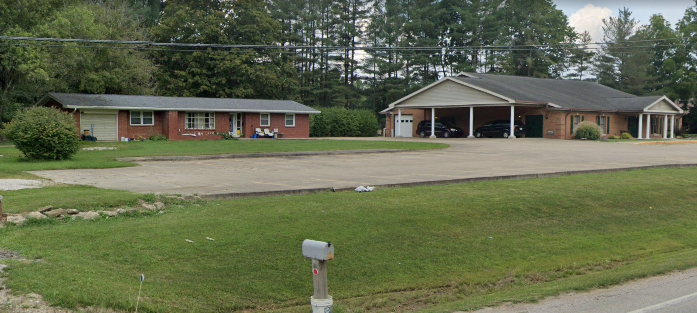
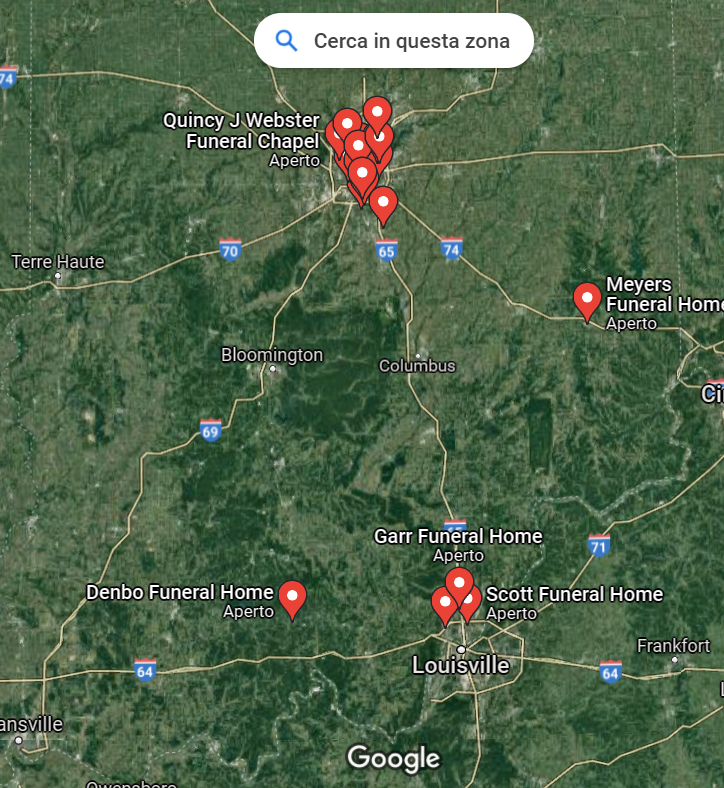
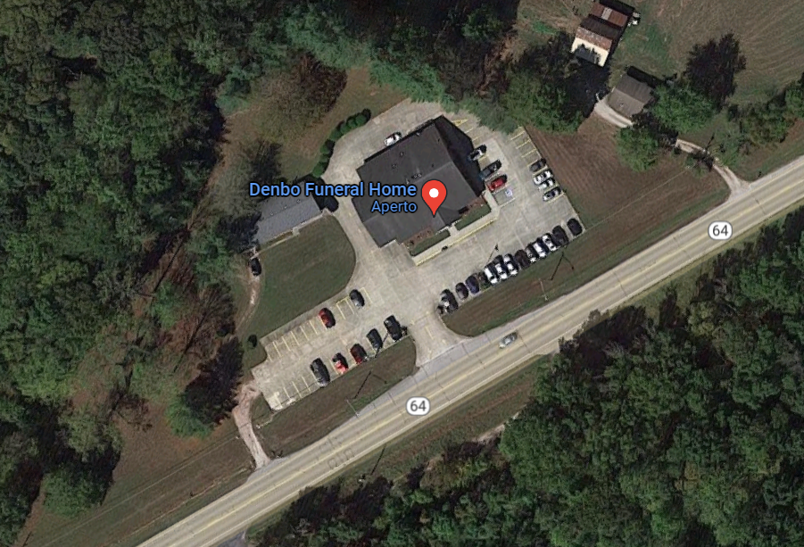

# MetaCTF CyberGames 2021 Write-ups
Event: **MetaCTF CyberGames 2021, 3-5 December 2021** | [official URL](https://metactf.com/cybergames)

Final position: **83th in Students-only Scoreboard, 174th in Global Scoreboard** | [Full Scoreboard here](https://ctftime.org/event/1476)

Our Team: **CangureTheFlat** | [CTFtime page](https://ctftime.org/team/137370)

Formed by: 
* [Gregorio Galletti](https://github.com/gregalletti)
* [Stefano Bagarin](https://github.com/stepolimi)

# Write Ups - Categories and Points
> We will list here just the most useful writeups for us, to better remember all the new knowledge learned.

## Cryptography

### Unbreakable Encryption
  

Ciphertext 1: 4fd098298db95b7f1bc205b0a6d8ac15f1f821d72fbfa979d1c2148a24feaafdee8d3108e8ce29c3ce1291

Plaintext 1: hey let's rob the bank at midnight tonight!

Ciphertext 2: 41d9806ec1b55c78258703be87ac9e06edb7369133b1d67ac0960d8632cfb7f2e7974e0ff3c536c1871b

### Company Picnic
  

We are given [this file](https://metaproblems.com/2c4d19e43f1a8c225fcd413bdebeaea2/public_keys.txt)

## Web

### WAS my flag? Part I
  

> https://metaproblems.com/327814c2aea7ea2c2e7969fb32d3ec47/

## Web

### WAS my flag? Part I
  

> https://metaproblems.com/327814c2aea7ea2c2e7969fb32d3ec47/

## Reversing

### I hate Python
  

> https://metaproblems.com/327814c2aea7ea2c2e7969fb32d3ec47/

## Recoinnassance

### I want my files back!
  

> https://metaproblems.com/a813fc7a6085f695ddb6ae1fd7658943/supercriticalfile.png.[AA4-MX4-GGQD]

### Mystery C2 Server
  

> https://metaproblems.com/a813fc7a6085f695ddb6ae1fd7658943/supercriticalfile.png.[AA4-MX4-GGQD]

## Other

### Interception I
  

> 192.168.0.1 is periodically (once every 4 seconds) sending the flag to 192.168.0.2 over UDP port 8000. Go get it.
> ssh ctf-1@host.cg21.metaproblems.com -p 7000

### Interception II
  

> Someone on this network is periodically sending the flag to ... someone else on this network, over TCP port 8000. Go get it.
> ssh ctf-46ed3559da08@host.cg21.metaproblems.com -p 7000

## Unsolved Challenges
Unfortunately, we did not manage to solve some challenges that were pretty feasible for us. Here I will put the writeups anyway because they may be helpful sooner or later.

### Tic Tac Toe 
  
**Reason of failure**: we are idiots

Flag: ****

### Pattern of Life
  
**Reason of failure**: we are idiots (again)

Flag: ****

### Source Code Shipping
  
**Reason of failure**: no time

Flag: ****

### Where's Vedder?
  
**Reason of failure**: no idea of US things, no time
> Please help find our dear friend Vedder Casyn. His last known location was this location. We believe it's within a public forest area in his home state.
> The answer should represent the MD5 hash of the address of the location.

I must say that, I was really close on this.

We know Vedder from the last year CTF, so we already know its social profiles [github](https://github.com/veddercasyn), (twitter)[https://twitter.com/veddercasyn], (linkedin)[https://www.linkedin.com/in/vedder-casyn/] and its (website)[https://veddercasyn.me/].

From these we know that he lives in Hammond, Indiana. This is the crucial point, I focused on this challenge the last hour, and I lost a lot of time by searching for forests in Hammond. Not Indiana. I'm just dumb because the description says **home state**, but when I realized that it was too late.

However, we are given this location to search:

I had no clue of what the building on the left was, but then after A LOT of research I found out that US funeral homes look like this (actually cool), so this is what we want to search.

Then we can see another building on the left that may be useful to filter the funeral homes we find, and in front of that what seems a parking lot.

The last two things are the trees right behind the buildings (pretty high ones) and a street right in front of them. Nice, we can start by searching the public forests in Indiana (:expressionless:).  
This area must be big, there is no way they want us to search for all little parks in a whole state. This is why all my researches through public institutes websites is useless.

By just looking at the Satellite view in Google Maps we can see that the northern part of Indiana seems empty, while the southern one seems more promising (guess where I searched for all the time...).

I think that maybe now the fastest way is to search for funeral homes here, and filter out the ones that are not within a forest area (actually look for *more green* areas):

Look! Just one of the result is totally within a green area: Dembo Funeral Home.  
Let's zoom in and see if we are good:

Everything matches: the street, the trees, the parking lot and the buildings. The address is: `628 IN-64, English, IN 47118` that in MD5 is `7be0798af71f79eadb9254d3554aa301`.

This was a really good challenge overall, but I can't help hating Mr. Casyn for all he did to me.

Flag: **7be0798af71f79eadb9254d3554aa301**

### Online Presence
  
**Reason of failure**: no time

Flag: ****

### New Spot
  
**Reason of failure**: no time

Flag: ****