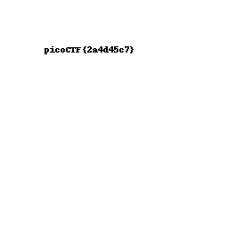
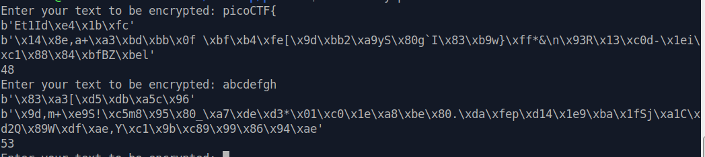

# Cryptography

## Mini RSA  

## Mind your Ps and Qs  
> Decrypt my super sick RSA:  
> c: 964354128913912393938480857590969826308054462950561875638492039363373779803642185  
> n: 1584586296183412107468474423529992275940096154074798537916936609523894209759157543  
> e: 65537

We can easily see that, as hinted, the modulus N is too small. In this way we can simply factor it (factordb) and get P and Q.  
Now we can calculate `PHI = (P-1)*(Q-1)` and `D = E^(-1) mod PHI`, to decrypt the given C we just calculate `M = C^D mod N` and convert it into text.

Flag: **picoCTF{sma11_N_n0_g0od_73918962}**

## Easy Peasy   

We are given a Python script granting an OTP encryption, so let's analyze it and find some weaknesses.  
Here is how the program works: it first encrypts the flag, then a loop is performed to get our input and encrypt it using a key of 50000 lenght, leading to different encryption of the same characters in different inputs. *start* is where the needed key part sholud start, and *stop* is where it should end.  
The most important rule of an One Time Pad is that the key is never reused in part or in whole. We notice this in the encryption part:
```python
if stop >= KEY_LEN:
   stop = stop % KEY_LEN
   key = kf[start:] + kf[:stop]
```
This means that if we reach the end of the key, we will restart and reuse the key from the beginning! Knowing that, we can trick the program in our favour.

Let's send 49968 characters (added to 32 of the flag we reach 50000), and then 32 chosen characters: we will obtain the characters encrypted with the SAME key as the flag.  
**Note:** at first I sent 32 'A's to encrypt, but I soon realized that sending 32 null bytes would lead to a quicker solution.

Let's first recover the encrypted flag by just connecting with `nc mercury.picoctf.net 41934`, so `0345376e1e5406691d5c076c4050046e4000036a1a005c6b1904531d3941055d`.  
Let's send this `python -c "print('A'*49968);print(b'\x00'*32)" | nc mercury.picoctf.net 41934` obtaining `6227515c7863625c7838615c7862345c7830345c7866385c7830307b5c786464`, our key.  

Now we just need to XOR the two values and obtain the flag:
```python
>>> ef=0x0345376e1e5406691d5c076c4050046e4000036a1a005c6b1904531d3941055d
>>> k=0x6227515c7863625c7838615c7862345c7830345c7866385c7830307b5c786464
>>> '{:x}'.format(ef^k)
'6162663266376435656466303832303238303736626664376134636665396139'
```
Translated into ASCII text, this will show the flag to submit and get the points.

Flag: **picoCTF{abf2f7d5edf082028076bfd7a4cfe9a9}**

## New Caesar  

What we have here is a ciphertext (_ihjghbjgjhfbhbfcfjflfjiifdfgffihfeigidfligigffihfjfhfhfhigfjfffjfeihihfdieieih_) and a python script: 
```python
import string

LOWERCASE_OFFSET = ord("a") # 97
ALPHABET = string.ascii_lowercase[:16] # abcdefghijklmnop

def b16_encode(plain):
	enc = ""
	for c in plain:
		binary = "{0:08b}".format(ord(c)) # just the binary value of the char, 'a' = 01100001
		enc += ALPHABET[int(binary[:4], 2)] # MSBs of the binary converted in decimal, used as index of alphabet
		enc += ALPHABET[int(binary[4:], 2)] # same with LSBs
	return enc

def shift(c, k):
	t1 = ord(c) - LOWERCASE_OFFSET
	t2 = ord(k) - LOWERCASE_OFFSET
	return ALPHABET[(t1 + t2) % len(ALPHABET)]

flag = "redacted"
key = "redacted"
assert all([k in ALPHABET for k in key]) # every char in the key is in the alphabet
assert len(key) == 1 # key of lenght 1 ???

b16 = b16_encode(flag)
enc = ""
for i, c in enumerate(b16):
	enc += shift(c, key[i % len(key)])
print(enc)
```

I added some comments in order to better understand the behaviour, and the most important thing we can notice is that **the key lenght is only 1**! This means that should be easy to invert the process and rewrite this script in order to decrypt the given ciphertext, bruteforcing the key on an alphabet of 16 characters.

We can divide the encryption algorithm in 2 parts: encode and shift. Now to decrypt we will need to first shift back the characters and then to decode.  
The switching part is kinda easy, just make t1 - t2 and we are done. The decoding part is more complex but we just reverse the whole process, so we take pairs of ciphertext letters, take their index in the ALPHABET and print them as binary (`zfill(4)` to make sure we have 4 bits).  
After that we concatenate them and convert this into a character, and by concatenating everything we can print a flag candidate. Of course we will do this for every possible key, and eventually we will find a suitable flag.

The final script is:
```python
import string
enc = "ihjghbjgjhfbhbfcfjflfjiifdfgffihfeigidfligigffihfjfhfhfhigfjfffjfeihihfdieieih"

LOWERCASE_OFFSET = ord("a")
ALPHABET = string.ascii_lowercase[:16]

def b16_decode(ctx):
	flag = ""
	for c in range(0, len(ctx) ,2):
	    first = "{0:b}".format(ALPHABET.index(ctx[c])).zfill(4)
	    second = "{0:b}".format(ALPHABET.index(ctx[c+1])).zfill(4)
	    res = first + second
	    flag += chr(int(res,2))
	return flag

def shiftBack(c, k):
	t1 = ord(c) - LOWERCASE_OFFSET
	t2 = ord(k) - LOWERCASE_OFFSET
	return ALPHABET[(t1 - t2) % len(ALPHABET)]

for key in ALPHABET:
    b16 = ""
    for i, c in enumerate(enc):
	    b16 += shiftBack(c, key[i % len(key)])
    flag = b16_decode(b16)
    print(flag)
```

Flag: **picoCTF{et_tu?\_0797f143e2da9dd3e7555d7372ee1bbe}**

## Mini RSA  

> What happens if you have a small exponent? There is a twist though, we padded the plaintext so that (M ** e) is just barely larger than N.

We are give `n, c and e` of an RSA problem. . The challenge text says _What happens if you have a small exponent?_ similar to the other MiniRSA challenge, but the message is said to be padded so that _(M ** e) is just barely larger than N_. What does this mean?  
We know that M\*\*e mod N = c, so also M\*\*e = c + x\*N. We need to find that x.

With such big numbers, this equation is like M\*\*e ~= x\*N: so we just need to find the cubic root of x\*N with (in this case) gmpy2: M = iroot(x\*N, 3). We can't know this value a priori but we can bruteforce in with a probably small time, due to the _barely larger_ fact. 

The final script is:
```python
import gmpy2

N = 1615765684321463054078226051959887884233678317734892901740763321135213636796075462401950274602405095138589898087428337758445013281488966866073355710771864671726991918706558071231266976427184673800225254531695928541272546385146495736420261815693810544589811104967829354461491178200126099661909654163542661541699404839644035177445092988952614918424317082380174383819025585076206641993479326576180793544321194357018916215113009742654408597083724508169216182008449693917227497813165444372201517541788989925461711067825681947947471001390843774746442699739386923285801022685451221261010798837646928092277556198145662924691803032880040492762442561497760689933601781401617086600593482127465655390841361154025890679757514060456103104199255917164678161972735858939464790960448345988941481499050248673128656508055285037090026439683847266536283160142071643015434813473463469733112182328678706702116054036618277506997666534567846763938692335069955755244438415377933440029498378955355877502743215305768814857864433151287
e = 3
c = 1220012318588871886132524757898884422174534558055593713309088304910273991073554732659977133980685370899257850121970812405700793710546674062154237544840177616746805668666317481140872605653768484867292138139949076102907399831998827567645230986345455915692863094364797526497302082734955903755050638155202890599808146919581675891411119628108546342758721287307471723093546788074479139848242227243523617899178070097350912870635303707113283010669418774091018728233471491573736725568575532635111164176010070788796616348740261987121152288917179932230769893513971774137615028741237163693178359120276497700812698199245070488892892209716639870702721110338285426338729911942926177029934906215716407021792856449586278849142522957603215285531263079546937443583905937777298337318454706096366106704204777777913076793265584075700215822263709126228246232640662350759018119501368721990988895700497330256765579153834824063344973587990533626156498797388821484630786016515988383280196865544019939739447062641481267899176504155482

for x in range(100000):
    m, found = gmpy2.iroot(x*N + c, e)
    if found:
        print("Found x = {}".format(x))
        print("Flag = {}".format(bytes.fromhex(hex(m)[2:]).decode('ASCII')))
        break
```

Flag: **picoCTF{e_sh0u1d_b3_lArg3r_60ef2420}**

## Dachshund Attacks  

We have a remote server where we can connect and obtain `e, n and c` of an RSA problem. The challenge text says _What if d is too small?_ (which is oddly ambiguous) and after some googling I found the [Wiener Attack](https://en.wikipedia.org/wiki/Wiener%27s_attack) (more ambiguous), feasible when d is small! If any doubt, this is confirmed from the fact that Dachshund is that little sausage dog, also called wiener dog.  
By searching for a python implementation I found [this one](https://github.com/orisano/owiener) awesome, and I used it to solve the problem.

By setting the given `e` and `n` we can obtain `d` with the attack, and after that we can simply decrypt the given `c`, convert it into hex and then ASCII and get the flag. This is the final script:
```python
import owiener

e = 115672417112927257671680305939934359365770610260861730036576852003995595676738019854156896978452695493499603711084199051703037741612104358554500922255601810699239639276721088454380220351087165317005776882604094492362559466589322345564816722986043365200197328901401825485278698288628276429261242166244230567489
n = 126464990415558983403176864213946695038601049351609225147898757728512524756706217511963198935092618068670554550413258741381432620153181016246126875941976724705392460289282557576686876928892251600322535922349244519540114524945350798877163247781257922671051428624372661514140723871265632532731717598340766266343
c = 111321497464016602005557521031123106684276292631071554434038480623506616443911260308781727450386770672481648306263904680048763443482585922984395943505671937379941613335472362526841433859265067829439266522906203272443815955305450235368266937689107285781709931596212063854029971643694610913742233468948132822071
d = owiener.attack(e, n)

if d is None:
    print("Failed")
else:
    print("Hacked d={}".format(d))

m = pow(c,d,n)

bytes_flag = bytes.fromhex(hex(m)[2:])
flag = bytes_flag.decode("ASCII")

print(flag)
```

Flag: **picoCTF{proving_wiener_6907362}**

## No padding, no problem  
> Oracles can be your best friend, they will decrypt anything, except the flag's ciphertext. How will you break it? 

If we connect to the server we only get the possibility to submit a ciphertext and get it decrypted, nothing else.  
We have a very important property of RSA, also called the multiplicative property: the multiplication (modulo n) of two ciphertexts is the same as the encryption of the multiplication of the two plaintexts, E(m)\*E(s) mod n = E(m\*s mod n), in fact since E(m)\*E(s) = m^e\*s^e mod n = (m\*s)^e mod n = (m\*s mod n)^e mod n. You can read more [here](http://secgroup.ext.dsi.unive.it/wp-content/uploads/2012/11/Practical-Padding-Oracle-Attacks-on-RSA.html).

We have N, e and ctx_flag, we can exploit the multiplicative property to perform a Chosen Ciphertext Attack on the remote server, choosing ptx2 = 2 and obtaining ctx2 = 2^e mod n; calculate ctx3 = ctx2\*ctx_flag and then submit it to the Oracle getting ptx3. Finally, since ptx3 = ptx2 \* ptx_flag we can get ptx_flag = ptx3 / ptx2

Let's take a look at numbers, from the remote server we get this:
```
n: 80799209814431095790343491259338238651107977352561235864565263656787018421467846733079894989328485497099422410585760003073248073860766557895750352694681971050346253898533173884271409890381084072547226455973760535398079441854389733568634600462617155511458397767430347644255066152450223025245316062323744020151
e: 65537
ciphertext: 40872946028823975975313513670752641684826068380477595686500937086157118355275592497669013278548614810724188401550378935134665758558547491918177306811706097537816022118750118661881706495647706460278367468016154374191035033632334666208160020365739127162462144281924917891906964041444797332706085490053170514935
```

Our calculations are:
```
ctx2 = 2^e mod N = 40935033850459547782904942040359212982473014053363343577187113044679713885186279744481179378912498180180392491144073758870887071124500925648494670883819915615287427404930386571885103041426211042682712925728699844156052023782715880204848567642909212286423862519582644456271219578652991085238899617068058078233

ctx3 = ctx2 * ctx_flag = 30710048674964052826548292045401307845982558650123791385884667431243560854988145736150020129083196263191298375858184314476153189719336525615024282711192479938593621545772507009793907796060288231201251375503929634767178982425215333628709400527885067579789820811531503857728144965096768255334621727074652950165

ptx3 = 580550060391700078946913236734911770139931497702556153513487440893406629034802718534645538074938502890769281669222390720762

ptx_flag = ptx3 / 2 = 290275030195850039473456618367455885069965748851278076756743720446703314517401359267322769037469251445384640834611195360381
```

And if we take the bytes and convert them into ASCII we will obtain the flag, `print(bytes.fromhex(hex(ptx_flag)[2:]))`.

Flag: **picoCTF{m4yb3_Th0se_m3s54g3s_4r3_difurrent_4005534}**

## spelling-quiz  
> I found the flag, but my brother wrote a program to encrypt all his text files. He has a spelling quiz study guide too, but I don't know if that helps.

I know, this probably is not the cleanest solution, but I would like to share it anyway.

In the .zip file we can see a flag.txt file, so I immediately tried to recognize the algorithm used to encrypt it. Even Cyberchef was not able to get it, so I tried [quipqiup](https://quipqiup.com/) because I was too lazy to do the things myself.  
By inserting our flag and selecting Solve (statistics) we can immediately see a meaningful string (*perhaps_the_dog_jumped_over_was_just_tired*), our flag. I selected statistics because of the keywords **spelling**, making me think about frequency analysis.

It turns out that this is the right path, but notice that I did not even looked at the `encrypt.py` source code or the `study-guide.txt` they provided us. If quipqiup wasn't enough, I could have used the study-guide (a bunch of strings probably encrypted in the same way of the flag) to perform a frequency analysis, and with the results obtain the flag.

Flag: **picoCTF{perhaps_the_dog_jumped_over_was_just_tired}**

## Pixelated  

This challenge gives us 2 images made by what seem random pixels, suggesting we can extract a flag from them. I immediately thought about performing a bitwise XOR beetween them, but unfortunately this did not work. At this point I was stuck, trying AND and OR operations too without success.  

I then tried to open them on StegSolve, a jar containing a lot of useful steganography tools like in this case the **Image Combiner**: by selecting the ADD operation we get this (I still can't reach the same result with Linux commands):



So here it is the flag: **picoCTF{2a4d45c7}**

## Play Nice  
> Not all ancient ciphers were so bad... The flag is not in standard format. nc mercury.picoctf.net 21003 [playfair.py](https://mercury.picoctf.net/static/3329978ea3a249ef44d929b41afc5370/playfair.py)

When connecting we have this, every time:
```
Here is the alphabet: 0uxtb3w4kj26q9m8gioe7nvahplr5dy1fzcs
Here is the encrypted message: xj5c181ropf5xjmyujnv0wlqrjdrbz
What is the plaintext message? 
```

If we take a look at the source code we can see what seems a standard implementation of Playfair, except the fact that the matrix is 6x6 and not the classical 5x5. By just reversing some instructions we can perform the decryption, being alphabet and ciphertext fixed.

```python
#!/usr/bin/python3 -u
import signal

SQUARE_SIZE = 6


def generate_square(alphabet):
	assert len(alphabet) == pow(SQUARE_SIZE, 2)
	matrix = []
	for i, letter in enumerate(alphabet):
		if i % SQUARE_SIZE == 0:
			row = []
		row.append(letter)
		if i % SQUARE_SIZE == (SQUARE_SIZE - 1):
			matrix.append(row)
	return matrix

def get_index(letter, matrix):
	for row in range(SQUARE_SIZE):
		for col in range(SQUARE_SIZE):
			if matrix[row][col] == letter:
				return (row, col)
	print("letter not found in matrix.")
	exit()

def encrypt_pair(pair, matrix):
	p1 = get_index(pair[0], matrix)	# find first letter in the matrix
	p2 = get_index(pair[1], matrix)	# find second letter in the matrix

	# get_index returns the pair (row, col)

	if p1[0] == p2[0]:	# row
		return matrix[p1[0]][(p1[1] + 1)  % SQUARE_SIZE] + matrix[p2[0]][(p2[1] + 1)  % SQUARE_SIZE]
	elif p1[1] == p2[1]:	# col
		return matrix[(p1[0] + 1)  % SQUARE_SIZE][p1[1]] + matrix[(p2[0] + 1)  % SQUARE_SIZE][p2[1]]
	else:
		return matrix[p1[0]][p2[1]] + matrix[p2[0]][p1[1]]

def encrypt_string(s, matrix):
	result = ""
	if len(s) % 2 == 0:
		plain = s
	else:
		plain = s + "0uxtb3w4kj26q9m8gioe7nvahplr5dy1fzcs"[0]	# just append 0 if odd
	for i in range(0, len(plain), 2):
		result += encrypt_pair(plain[i:i + 2], matrix)
	return result

alphabet = open("key").read().rstrip()
m = generate_square(alphabet)	# just create a 6x6 matrix with alphabet letters (we know this)
msg = open("msg").read().rstrip()
enc_msg = encrypt_string(msg, m)
print("Here is the alphabet: {}\nHere is the encrypted message: {}".format(alphabet, enc_msg))
signal.alarm(18)
resp = input("What is the plaintext message? ").rstrip()
if resp and resp == msg:
	print("Congratulations! Here's the flag: {}".format(open("flag").read()))

# https://en.wikipedia.org/wiki/Playfair_cipher
```

Notice that in the code we can also see a comment leading to Playfair cipher on Wikipedia. I then tried to verify if the algorithm was really standard, bruteforcing all the possible decrypted texts, leading to a bunch of strings, among which we can see our previously obtained plaintext value: this was an alternative solution.

```python
SQUARE_SIZE = 6
alphabet = "0uxtb3w4kj26q9m8gioe7nvahplr5dy1fzcs"
enc = "xj5c181ropf5xjmyujnv0wlqrjdrbz"

def generate_square(alphabet):
	assert len(alphabet) == pow(SQUARE_SIZE, 2)
	matrix = []
	for i, letter in enumerate(alphabet):
		if i % SQUARE_SIZE == 0:
			row = []
		row.append(letter)
		if i % SQUARE_SIZE == (SQUARE_SIZE - 1):
			matrix.append(row)
	return matrix


m = generate_square(alphabet)

def get_index(letter, matrix):
	for row in range(SQUARE_SIZE):
		for col in range(SQUARE_SIZE):
			if matrix[row][col] == letter:
				return (row, col)
	print("letter not found in matrix.")
	exit()

def decrypt_pair(pair, matrix):

	p1 = get_index(pair[0], matrix)
	p2 = get_index(pair[1], matrix)

	if p1[0] == p2[0]:	# row
		return matrix[p1[0]][(p1[1] - 1)  % SQUARE_SIZE] + matrix[p2[0]][(p2[1] - 1)  % SQUARE_SIZE]	# invert constants
	elif p1[1] == p2[1]:	# col
		return matrix[(p1[0] - 1)  % SQUARE_SIZE][p1[1]] + matrix[(p2[0] - 1)  % SQUARE_SIZE][p2[1]]	# invert constants
	else:
		return matrix[p1[0]][p2[1]] + matrix[p2[0]][p1[1]]

def decrypt_string(s, matrix):
	result = ""
	for i in range(0, len(s), 2):
		result += decrypt_pair(s[i:i + 2], matrix)
	return result

dec = decrypt_string(enc, m)

print(dec)
```

If we submit this as plaintext we obtain an hex value, and this is the flag because it's not in the usual format: **3f4b60ebf36369258d8638d2038c7ad1**

## Double DES  

From the source code we can see that it's a quite regular 2DES encryption, despite the fact that the keys are only 6 bytes long instead of the classical 8 bytes. A padding is applied to them and to the plaintext to reach 8 bytes long blocks.

It's well known that **2DES is vulnerable to meet-in-the-middle** attacks. In fact if we look at [Wikipedia](https://en.wikipedia.org/wiki/Meet-in-the-middle_attack) we can see a really handy formula for this challenge.

The fact that the keys are shorter makes the attack even faster. The remote server gives the encrypted flag and let us provide a plaintext to encrypt, giving us the corresponding ciphertext.  
The idea is to get all of this (we can choose the plaintext as we want) and then perform the attack: we will encrypt our plaintext with all the possible keys first, then decrypy the ciphertext with all the possible keys. I saved all the results in a dictionary (`dic`) to get a faster access to the values and have an immediate key-ctx corrispondence.

After that we will compare the results: if there is a match between two of them we will have a candidate key1-key2 couple to use to double decrypt the encrypted flag.

This last step is done by just reversing the given `encrypt_double` function into `decrypt_double` function, while `pad` remains the same.

_Note: normally we would have to test the whole set of candidate keys, while in this challenge we can stop at the first one and get the flag correctly._

This is the script I used (I struggled a lot with payload sending, then I realized it has to be an hex value):
```python
from pwn import *
import itertools
from Crypto.Cipher import DES

menu_end = "Here is the flag:\n"
data_end = "What data would you like to encrypt? "

r = remote("mercury.picoctf.net", 31991)

log.info("Getting encrypted flag...")
r.recvline()
enc_flag = r.recvlineS().strip()
log.success("Encrypted flag = {}".format(enc_flag))

payload = b"ABCDE"
log.info("Sending my custom data ({})...".format(payload))
r.sendlineafter(data_end, enhex(payload))	
enc_payload = r.recvlineS().strip()
log.success("Encrypted payload = {}".format(enc_payload))
enc_payload = bytes.fromhex(enc_payload)

def pad(msg):
    block_len = 8
    over = len(msg) % block_len
    pad = block_len - over
    return (msg + " " * pad).encode()

def double_decrypt(m, key1, key2):
    cipher2 = DES.new(key2, DES.MODE_ECB)
    dec_msg = cipher2.decrypt(m)

    cipher1 = DES.new(key1, DES.MODE_ECB)
    return cipher1.decrypt(dec_msg)

dic = {}

for key1 in map(''.join, itertools.product('0123456789', repeat=6)):
	key1 = pad(key1)
	cipher1 = DES.new(key1, DES.MODE_ECB)
	enc_k1 = cipher1.encrypt(pad(payload.decode()))
	dic[enc_k1] = key1

for key2 in map(''.join, itertools.product('0123456789', repeat=6)):
	key2 = pad(key2)
	cipher2 = DES.new(key2, DES.MODE_ECB)
	dec_k2 = cipher2.decrypt(enc_payload)
	if(dec_k2 in dic):
		key1 = dic[dec_k2]
		log.info("found {} and {} with {}".format(key1,key2,dec_k2))
		log.success(double_decrypt(unhex(enc_flag), key1, key2))
		break
```

Flag (non-standard format): **6d4e063d16d250b953d009e2ef07e241**

## Compress and Attack  

We are given a pretty simple source code:
```python
import zlib
from random import randint
import os
from Crypto.Cipher import Salsa20

flag = open("./flag").read()


def compress(text):
    return zlib.compress(bytes(text.encode("utf-8")))

def encrypt(plaintext):
    secret = os.urandom(32)
    cipher = Salsa20.new(key=secret)
    return cipher.nonce + cipher.encrypt(plaintext)

def main():
    while True:
        usr_input = input("Enter your text to be encrypted: ")
        compressed_text = compress(flag + usr_input)
        encrypted = encrypt(compressed_text)
        
        nonce = encrypted[:8]
        encrypted_text =  encrypted[8:]
        print(nonce)
        print(encrypted_text)
        print(len(encrypted_text))

if __name__ == '__main__':
    main() 
```

`Salsa20` is used, but unfortunately there are no known vulnerabilities at the moment.

At this point I thought about the fact that maybe there is a reason why they give us the length of the encrypted text: our input is concatenated to the flag and then compressed. Mmmh, let's take a look at how zlib works: reading [this](https://www.euccas.me/zlib/) I focused on this statement, _Codes for more frequently occurring data symbols are shorter than codes for less frequently occurring data symbols._

So probably, knowing that `picoCTF{` is part of the flag for sure, we can exploit this. Let's try to submit that as input and see what happens:



In the image above you can see that the two inputs provided, even if of the same size, give us back a really different ciphertext length. Cool, maybe we are on the right path.

I wrote a Python script to see if this really worked, and I initially found `picoCTF{s`. Now I tried to bruteforce all the remaining characters, knowing that the ciphertext lenght must be always 48 and the alphabet is made of letters, underscore and braces (hint).  
I handled the fact that the server will disconnect us after a fixed amount of time by just reconnecting again.

```python
from pwn import *
import string

TARGET_LEN = 48
menu_end = "Enter your text to be encrypted: "
payload = "picoCTF{"
alphabet = string.ascii_letters + "_}"

r = remote("mercury.picoctf.net", 29350)

while(True):
	for char in alphabet:
		try:
			r.sendlineafter(menu_end, payload + char)
			r.recvline() # discard value
			r.recvline() # discard value
			length = int(r.recvlineS().strip()) # get ciphertext length

			if (length == TARGET_LEN):
				payload += char
				log.success(payload)
		except:
			r = remote("mercury.picoctf.net", 29350)
```

Flag: **picoCTF{sheriff_you_solved_the_crime}**

## Scrambled: RSA  
> Hmmm I wonder if you have learned your lesson... Let's see if you understand RSA and how the encryption works. Connect with nc mercury.picoctf.net 6276

After connecting we can see a **really big flag ciphertext**, clearly longer than the modulus, so something is wrong here: either we need to make the modulus ourselves or this is not a standard RSA.  
To verify that, let's try by making the server encrypt 0 or 1, that in textbook's RSA should be again 0 and 1. This won't happen, so we are pretty sure to face a non-standard RSA encryption, maybe using some sort of concatenation beetween encrypted text.

We can try to submit 0, take note of the value and then submit 00:
```console
I will encrypt whatever you give me: 0
Here you go: 50311592995438381306389913732037211734553709080466285523074903765196971830541407548381481329629690830955624169617997569009486912188400261361757714828916556889606724728712480347097214533708839728921615672809369581411102785693629790827329102183359108330988324873766899978686397589793347512513203545753222766619
I will encrypt whatever you give me: 00
Here you go: 503115929954383813063899137320372117345537090804662855230749037651969718305414075483814813296296908309556241696179975690094869121884002613617577148289165568896067247287124803470972145337088397289216156728093695814111027856936297908273291021833591083309883248737668999786863975897933475125132035457532227666193133480239880342471419233419047243028400109621630450593637416056848658610853146460869784925414062689870866861690056089432667374810788309272364970663254858791262361544302929083549101597317857203305042867576515618731303502458667947539567415947468591287826364497199317077964545686035556832289163553852590385387
```

Oh nice, so the starting string is the same (5031...) meaning that a concatenations happens for sure, also because the lenght is exactly double. We can now extract the second part of the string (3133...) and take note of that. By submitting again 00, we can notice that sometimes the output is the same as before, and sometimes the two strings are inverted: maybe the _Scrambled_ in the title means this.

With another connection (so values will change) I tried this:
```console
I will encrypt whatever you give me: 0
Here you go: 6812590580358489793939594547231948005229422833307752920885692817994225429073287144861561053472393528843536254632474388770528782277865557607737021290403403014815302177465926087670599850346804642321051039901671543186322679079702656572997916222867738262752229317551332683593604581029542581242482953778106395568
I will encrypt whatever you give me: 1
Here you go: 40975091399474059624560620395152829378187878272070085573100082608075786385844016008967997101745839222973814519860458572306702201905658377845257623425681879738537182426493174529546520607816140235411756090448246729260198107454092394744558040247646974590524010539399167715086815302986258735580149871723800722060
```

and this:
```console
I will encrypt whatever you give me: 01
Here you go: 68125905803584897939395945472319480052294228333077529208856928179942254290732871448615610534723935288435362546324743887705287822778655576077370212904034030148153021774659260876705998503468046423210510399016715431863226790797026565729979162228677382627522293175513326835936045810295425812424829537781063955681011029085912618409937643027762992745164022277133649274192660814146122869924769472813364335904283518317093321763129560241606640976655495127215542069464364730714019165611385532900116749145052707683134651917009490172249552363422864807189777733647074317442927636235849785390074368886838213811318169465262476208
```

thus I had the proof that `0_enc` is contained in `01_enc`. Let's formalize a bit: `01_enc = 0_enc + x` (note that `x` may seem `1_enc` but is not), so `x = 01_enc - 0_enc`, we can see `x` just as a **representation** of `1_enc`.
```console
I will encrypt whatever you give me: 012
Here you go: 5647350904095569483699801158524892980435994806564645359618035700216645707850259039156526617853492774406168553127778088879980051323173918469346285274530833669541481330155853304928929274508774221846069086233441018229454331640932173850801985780853985202100779908030678049093908951517787244363637230647806900100810110290859126184099376430277629927451640222771336492741926608141461228699247694728133643359042835183170933217631295602416066409766554951272155420694643647307140191656113855329001167491450527076831346519170094901722495523634228648071897777336470743174429276362358497853900743688868382138113181694652624762086812590580358489793939594547231948005229422833307752920885692817994225429073287144861561053472393528843536254632474388770528782277865557607737021290403403014815302177465926087670599850346804642321051039901671543186322679079702656572997916222867738262752229317551332683593604581029542581242482953778106395568
```

In this string we can find both `0_enc` and `x`, in fact `012_enc = y + x + 0_enc`, so `x = 01_enc - 0_enc` and `y = 012_enc - 0_enc + 0_enc - 01_enc = 012_enc - 01_enc`, again `y` is a representation of `012_enc`:
```
56473509040955694836998011585248929804359948065646453596180357002166457078502590391565266178534927744061685531277780888799800513231739184693462852745308336695414813301558533049289292745087742218460690862334410182294543316409321738508019857808539852021007799080306780490939089515177872443636372306478069001008
1011029085912618409937643027762992745164022277133649274192660814146122869924769472813364335904283518317093321763129560241606640976655495127215542069464364730714019165611385532900116749145052707683134651917009490172249552363422864807189777733647074317442927636235849785390074368886838213811318169465262476208
6812590580358489793939594547231948005229422833307752920885692817994225429073287144861561053472393528843536254632474388770528782277865557607737021290403403014815302177465926087670599850346804642321051039901671543186322679079702656572997916222867738262752229317551332683593604581029542581242482953778106395568
```

and so on, always with different position because the concatenation is scrambled.  
I think we now have enough information to sketch an attack idea: we know that `012_enc` contains `01_enc` (in some order), so we can apply the same to the flag. We know the flag starts with `picoCTF{`, so we can immediately try and verify this: if the given `flag_enc` contains `picoCTF{_enc` we know we are on the right path.

Again with different numbers (server keeps disconnecting me):
```console
flag: 60965538669910513190820285941908889354006462724111833175356997355059562850829558201267234103215294980569036935841540357119700174640774165126471334910414933295057728555460712795017483531081352466060287907476540731987731421516356679236210470584425892334991461576600398243634365273889850910583317581366757181685763754550972543078975725211049964419740236472526657467117590917918119133099812209475363590951075893866959281238256843339501807003670457585994206399606236914713292660763686689445995954745206640407285215009886494891282594398131668362007255587981475704318735224969838079935119166021961125622959161671053404884876318201458058954962822121897637321165132661113845569146134057518550484232883108521647693577419717676962644541619491046446113778316499226738042138791223943160206579342299697709454972076467865378300122317507321813999083953509470977484891275943238147129516988127836272719814700405162779962675390888088078933521268449366211242609115669598268878861794561484509709199003631413900387235450355191861162303021853566698420376347466350692676931733407512005702870673000674778970059885145210270790233452554537217065410462829046258294653598179234422799581967364921240129222026517588653812478151088019421911608536427205401932543448572335681012897754359152720744122169655724501261350210320126153708311944570206273496388129186109456854689478443999010116914940965244169511168567219039336829142242863595156618147836392098045059032022119678262229392109549107696470651481448870017786084351018219211234994447520516203752033327271797623673617033028828547137269093195541212271945175427812695481366733615387879515158428569066788712701325445208429209689491386237765803525511353307299882270947211477911489857622744424103565636439353058752958397604443795666994736352706111252740330971258191304535389895483799777360091615089430024403375655474738245689324229310525516312807843717027010672033909514964384567970354192355690511454005008154903204932993726694024952577422735188938985219991924445149477809752762011652509535131394748259081510387543005569286882310655792493621998408851348299170971920569654643942782858734300149123305840957181822977179982984165640372490295605981134057968778648858320641783521122077282939698128382644599474068851110572349989250635042733556264977700275425855413096070414213773118070385053357979149579284966898516887593985341713675218524395486458271914767920717906992038628544622775803285253319961559601346414140293765201735527628821060360468533147486423618429810600901327038397010704355188295639006346657108571907447371309675328868908948571450138376066445788576945388756528226977594102918036808568288915977758822426574548002135286784949206853087085513981177587789830998126026053617706663920677605499831118642724837184428326580578702814510723986056850751171064814014428335727427381093825919290753327893347114099817979140597245566993706549110058379292158276769980457512319632745275101871174528400819804146153443516030872178368692145447121705946644325299322714934537734723650805623141125195272097599132080564421372017412536630478122633296371360712281132702964120344479209575991147889887126877559374160797819230920498473810478410104752208860293452712002428169134953121261868702294427522457421069316263866598476640434557156882144740111641779803971043142575238216515940768367171617226646874644791100995041844729677790704640872381790961268858970617837203768117961713861763962451945594455108276281908077597115945375352897489232910694280895552410005002572094104147371361639637314754886765307650722711021751784518395695875004142775129695989937081980568489021366514737791576358874217579530938303757063120988279225494724342692878190788457362511372904569861651952300931697472675767354191588833435810147349199941552156706321074236479393537063175349673970601474952077739746081096234160891338317548118066997876023799258633328126810847120120535475895766847947869243165893807901800431988322528494125360226099495912644097037765880989735594362741364522260408549892605095324995154860991300649487661046200608822527933271705412568882588988014462056535669813304003783923311788829081434583120535555304721350904710473713351801469493079969637256063783778402890537036971614897071767245645989367087922040880331422248913941468882001191545619613563634493251207445110888438856130466358056376014340866921920299920050611132549570332873015630265902198885310074636727199416715729480648413249944881488593508926837999377738135995658834092848174105537511215513918298489986149223923360835620650430792851034457307215633492660459744172825798346759187709433760806288791840668423456530533218930887929626541273877161402476219391323708841639563709923381354826120758918735249208787109711082288752235730423830543815961290542139922193960540639150719549789678834247940598502339124108161365334697544170442901047095280868649636252373381797331548836338901302483787876535668513463089794830657998755928018605222861991499060294104208605218530224956733039378864557465891905561129568137136256532782435782010424016980062822346173886712202626826549824893757988276170552648395054010643845246882849128932549245555502104825665266468155492303064320976872799392253184829181444817783519581454760398915153806323863972076619767132224761534474469213425572773163712243685327833177926897095405773613058685538570822293151117313931342736787750941989095596052417467885142675288030820006575977644925762980560107492481926499190384060214103477036093276859176703490494989080557023474620533690273008374493962490139229055653017828667482159484888372141960118356908437577480155913538486218672438106353680970018000254578113570029923612729683501476891066761386279005167191750701228365675686025025286551039224537921537293200972996450046186692342794937250522437562686062114247485055031948023291131410094342461189099775723314068436523665710400281463762729049493438272716964183450897402278354033593594292800687948084454406568265637826987235249224862923825725315271323088337321214693374758750803349322574492113113930062647678672661110736419093306889878399720511180737662876641568376777722474761945367369317275912500212284925573787551883092697820472225155865903829665334872954288045050207642215357448451593648149374005008578992063595284986986461115916629538138476349128848826792274170847197836127712028703846952934396679452391258301454198068052991684460610773859357886513408481721561545389633035532864778532294143378542497052010876807914295668833776000827078627040311622833472420687950657878592192647289466446053208514755890832879513054781472060255146531746261679979851897442492382552802526365851619505273332591638656374965119680973897117148585620758496618156432063506381333512512352577096969819458876869477355902191422655676641164752367028304652745335373079053788698825550275438254477270695297688088496163093041792179184202464075716956910584195062747916636834710765753537920648547961603136961738395171296548568256283946356978576242940694604441579270254364535110214797867988120710143669218515737206959403049126624410983521841287896075419131701469237291959645497133231596093937699960372495729934323748547889306129948643841241795024739202770869958063639690602599144684122211381138119671870155365235308400224322735770730077800139749903134332354647784149109860654591171099811946152070100576884733559216359717175018451490593097343135355905549566858940954174026103836297658174507542809044450926195214791403625068816277291443119351852735833608829717300696187994992508693863487411375953812802047436604866602030826657906203736343908079777332141759024592966188966341578773078030234480250645615148929866412892000144615305345067925874143461255992311438371150068803379576973689725510775906887351071511972102165443198306117423871666731996392423453899509003482406780618228524930207613072459084092420649129616845153948868018974213668596227893458148861791576154685292630421668675573511271705657558414509897195125736718017911915476823925011458031892925007479145597852625114816296981946361168360258229382601925474892426207994362610564800588220137666242961316806511655403599594191824202576110607374642750248985402554

p_enc: 98723524922486292382572531527132308833732121469337475875080334932257449211311393006264767867266111073641909330688987839972051118073766287664156837677772247476194536736931727591250021228492557378755188309269782047222515586590382966533487295428804505020764221535744845159364814937400500857899206359528498698646

pi_enc: 12075891873524920878710971108228875223573042383054381596129054213992219396054063915071954978967883424794059850233912410816136533469754417044290104709528086864963625237338179733154883633890130248378787653566851346308979483065799875592801860522286199149906029410420860521853022495673303937886455746589190556112998723524922486292382572531527132308833732121469337475875080334932257449211311393006264767867266111073641909330688987839972051118073766287664156837677772247476194536736931727591250021228492557378755188309269782047222515586590382966533487295428804505020764221535744845159364814937400500857899206359528498698646

i_enc = pi_enc - p_enc = 120758918735249208787109711082288752235730423830543815961290542139922193960540639150719549789678834247940598502339124108161365334697544170442901047095280868649636252373381797331548836338901302483787876535668513463089794830657998755928018605222861991499060294104208605218530224956733039378864557465891905561129

flag contains both i_enc and p_enc
```

Let's generalize this to write a script:
- encrypt p, get `p_enc`, check if p_enc is in flag_enc
- encrypt pi, get `i_enc = pi_enc - p_enc`, check if i_enc is in flag_enc
- encrypt pic, get `c_enc = pic_enc - pi_enc`, check if c_enc is in flag_enc
- continue until `}_enc` 

```python
from pwn import *
import string
data_end = "I will encrypt whatever you give me: "

r = remote("mercury.picoctf.net", 6276)

flag_enc = r.recvuntil("\nn: ").decode().strip()
flag_enc = flag_enc.replace("flag: ", "")
r.recvline()
r.recvline()

def get_new_enc(to_remove, encoded):
	for r in to_remove:
		encoded = encoded.replace(r, "")
	return encoded

payload = ""
known_enc = []

with log.progress('Getting flag: ') as l:
	while('}' not in payload):
		for char in string.printable:
		
			r.sendlineafter(data_end, payload + char)
			enc = r.recvline().decode().strip()
			enc = enc.replace("Here you go: ", "")
			new_enc = get_new_enc(known_enc, enc)
	
			if(new_enc in flag_enc):
				payload += char
				known_enc.append(new_enc)
				l.status(payload)
				break
				
log.success("Obtained flag {}".format(payload))
```

Flag: **picoCTF{bad_1d3a5_2268684}**

## XtraORdinary  

This is the source code we have (I addedd some comments):
```python
#!/usr/bin/env python3

from random import randint

with open('flag.txt', 'rb') as f:
    flag = f.read()

with open('secret-key.txt', 'rb') as f:
    key = f.read()

def encrypt(ptxt, key):
    ctxt = b''
    for i in range(len(ptxt)):
        a = ptxt[i]
        b = key[i % len(key)]
        ctxt += bytes([a ^ b])	# just XOR char to char the ptx with the key
    return ctxt

ctxt = encrypt(flag, key)	# 1 encryption

random_strs = [
    b'my encryption method',
    b'is absolutely impenetrable',
    b'and you will never',
    b'ever',
    b'ever',	# repeated
    b'ever',	# repeated
    b'ever',	# repeated
    b'ever',	# repeated
    b'ever',	# repeated
    b'break it'
]

for random_str in random_strs:									# for every string
    for i in range(randint(0, pow(2, 8))):						# useless
        for j in range(randint(0, pow(2, 6))):					# useless
            for k in range(randint(0, pow(2, 4))):				# useless
                for l in range(randint(0, pow(2, 2))):			# useless
                    for m in range(randint(0, pow(2, 0))):		# 0 or 1, XOR or not
                        ctxt = encrypt(ctxt, random_str)		

with open('output.txt', 'w') as f:
    f.write(ctxt.hex())
```

So, XORing 6 times the ctxt with 'ever' is useless, because we all know that this will get us back to the ctxt, so we can reduce that to only one occurrence of 'ever'. For the same reason the repeated loops are useless because either we XOR or not, if we do it 2 times is like doing it 0 times or 4 times.

Knowing that I wrote a Python script that takes the ciphertext which they gave us, replicates the super mega big loop (a cleaned version) decrypting the ctxt until we find a possible key and then decrypt the whole ciphertext with the key.

Note that a key to be valid should be printable, and I obtain it by XORing back the "last" ciphertext with the "expected" plaintext (that starts with picoCTF...), this because it was the only way to do that, also because based on how the encryption works the key must be shorter than the plaintext.

```python
from random import randint

ctxt = bytes.fromhex("57657535570c1e1c612b3468106a18492140662d2f5967442a2960684d28017931617b1f3637")
random_strs = [		# cleaned version
    b'my encryption method',
    b'is absolutely impenetrable',
    b'and you will never',
    b'ever',
    b'break it'
]

def decrypt(ctxt, key):
    ptxt = b""
    for i in range(len(ctxt)):
        a = ctxt[i]
        b = key[i % len(key)]
        ptxt += bytes([a ^ b])	# just XOR char to char the ptx with the key
    return ptxt

def get_key(ctxt):
    expected = b"picoCTF"
    key = b""
    for i in range(len(expected)):
        a = ctxt[i]
        b = expected[i]
        key += bytes([a ^ b])  # just XOR char to char the ptx with the key
    return key

while True:
    for random_str in random_strs:                  # for every string
        for m in range(randint(0, pow(2, 0))):      # 0 or 1, XOR or not
            ctxt = decrypt(ctxt, random_str)        
    
    candidate_key = get_key(ctxt)

    if(candidate_key.decode()).isprintable():
        candidate_flag = (decrypt(ctxt, candidate_key)).decode()
    
        if (candidate_flag.isprintable() and ("picoCTF{" in candidate_flag)):
            print(candidate_flag)
            break
```

Flag: **picoCTF{w41t_s0_1_d1dnt_1nv3nt_x0r???}**

## triple secure  
> To get the flag, you must break RSA not once, but three times!

We are given a Python script on how the triple encryption works, but the first thing we can see is that the three prime factors (`p, q and r`) are reused to get the new modulus each time. With this known, we can immediately see a relationship between `n1, n2 and n3`, thus compromising the security of the whole encryption:
```python
#!/usr/bin/env python3

from Crypto.Util.number import getPrime, bytes_to_long

with open('flag.txt', 'rb') as f:
    flag = f.read()

p = getPrime(1024)
q = getPrime(1024)
r = getPrime(1024)

n1 = p * q
n2 = p * r
n3 = q * r
# prime factors reutilization, SOOOO BAD

moduli = [n1, n2, n3]

e = 65537
c = bytes_to_long(flag)

for n in moduli:
    c = pow(c, e, n)

with open('public-key.txt', 'w') as f:
    f.write(f'n1: {n1}\n')
    f.write(f'n2: {n2}\n')
    f.write(f'n3: {n3}\n')
    f.write(f'e: {e}\n')
    f.write(f'c: {c}\n')
```

This is the relationship:
`n1 * n2 * n3 = pq * pr * qr = p^2 * q^2 * r^2`
`sqrt(n1*n2*n3) = pqr = x`
`p = x / qr = x / n3`
`q = x / pr = x / n2`
`r = x / qp = x / n1`

These are the values we have from the challenge description:
```
n1: 15192492059814175574941055248891268822162533520576381643453916855435310880285336743521199057138647926712835561752909538944229702432795423884081992987060760867003375755338557996965825324749221386675061886921763747311599846248565297387814717840084998677273427776535730840343260681623323972936404815862969684384733188827100528542007213405382537935243645704237369770300643318878176739181891072725262069278646319502747718264711249767568106460533935904219027313131270918072460753061248221785076571054217566164086518459844527639082962818865640864990672033657423448004651989761933295878220596871163544315057550871764431562609
n2: 15896482259608901559307142941940447232781986632502572991096358742354276347180855512281737388865155342941898447990281534875563129451327818848218781669275420292448483501384399236235069545630630803245125324540747189305877026874280373084005881976783826855683894679886076284892158862128016644725623200756074647449586448311069649515124968073653962156220351541159266665209363921681260367806445996085898841723209546021525012849575330252109081102034217511126192041193752164593519033112893785698509908066978411804133407757110693612926897693360335062446358344787945536573595254027237186626524339635916646549827668224103778645691
n3: 16866741024290909515057727275216398505732182398866918550484373905882517578053919415558082579015872872951000794941027637288054371559194213756955947899010737036612882434425333227722062177363502202508368233645194979635011153509966453453939567651558628538264913958577698775210185802686516291658717434986786180150155217870273053289491069438118831268852205061142773994943387097417127660301519478434586738321776681183207796708047183864564628638795241493797850819727510884955449295504241048877759144706319821139891894102191791380663609673212846473456961724455481378829090944739778647230176360232323776623751623188480059886131
e: 65537
c: 5527557130549486626868355638343164556636640645975070563878791684872084568660950949839392805902757480207470630636669246237037694811318758082850684387745430679902248681495009593699928689084754915870981630249821819243308794164014262751330197659053593094226287631278905866187610594268602850237495796773397013150811502709453828013939726304717253858072813654392558403246468440154864433527550991691477685788311857169847773031859714215539719699781912119479668386111728900692806809163838659848295346731226661208367992168348253106720454566346143578242135426677554444162371330348888185625323879290902076363791018691228620744490
```

And now we can write a simple script to calculate and decrypt everything, paying attention to treats everything as **integer**:
```python
import gmpy2
from Crypto.Util.number import inverse, long_to_bytes

n1 = 15192492059814175574941055248891268822162533520576381643453916855435310880285336743521199057138647926712835561752909538944229702432795423884081992987060760867003375755338557996965825324749221386675061886921763747311599846248565297387814717840084998677273427776535730840343260681623323972936404815862969684384733188827100528542007213405382537935243645704237369770300643318878176739181891072725262069278646319502747718264711249767568106460533935904219027313131270918072460753061248221785076571054217566164086518459844527639082962818865640864990672033657423448004651989761933295878220596871163544315057550871764431562609
n2 = 15896482259608901559307142941940447232781986632502572991096358742354276347180855512281737388865155342941898447990281534875563129451327818848218781669275420292448483501384399236235069545630630803245125324540747189305877026874280373084005881976783826855683894679886076284892158862128016644725623200756074647449586448311069649515124968073653962156220351541159266665209363921681260367806445996085898841723209546021525012849575330252109081102034217511126192041193752164593519033112893785698509908066978411804133407757110693612926897693360335062446358344787945536573595254027237186626524339635916646549827668224103778645691
n3 = 16866741024290909515057727275216398505732182398866918550484373905882517578053919415558082579015872872951000794941027637288054371559194213756955947899010737036612882434425333227722062177363502202508368233645194979635011153509966453453939567651558628538264913958577698775210185802686516291658717434986786180150155217870273053289491069438118831268852205061142773994943387097417127660301519478434586738321776681183207796708047183864564628638795241493797850819727510884955449295504241048877759144706319821139891894102191791380663609673212846473456961724455481378829090944739778647230176360232323776623751623188480059886131
e = 65537
c = 5527557130549486626868355638343164556636640645975070563878791684872084568660950949839392805902757480207470630636669246237037694811318758082850684387745430679902248681495009593699928689084754915870981630249821819243308794164014262751330197659053593094226287631278905866187610594268602850237495796773397013150811502709453828013939726304717253858072813654392558403246468440154864433527550991691477685788311857169847773031859714215539719699781912119479668386111728900692806809163838659848295346731226661208367992168348253106720454566346143578242135426677554444162371330348888185625323879290902076363791018691228620744490

x = gmpy2.isqrt(n1 * n2 * n3)

p = x // n3
q = x // n2
r = x // n1

phi_1 = (p - 1)*(q - 1)
phi_2 = (p - 1)*(r - 1)
phi_3 = (q - 1)*(r - 1)

d1 = inverse(e, phi_1)	# get the multiplicative inverse of e mod phi_1
d2 = inverse(e, phi_2)
d3 = inverse(e, phi_3)

n_array = [n1, n2, n3]	# use arrays just to make this scalable
d_array = [d1, d2, d3]
l = len(n_array)

for i in range(0, l):
	c = pow(c, d_array[l-1-i], n_array[l-1-i])

m = c
flag = long_to_bytes(m).decode()
print(flag)
```

Flag: **picoCTF{1_gu3ss_tr1pl3_rs4_1snt_tr1pl3_s3cur3!!!!!!}** 