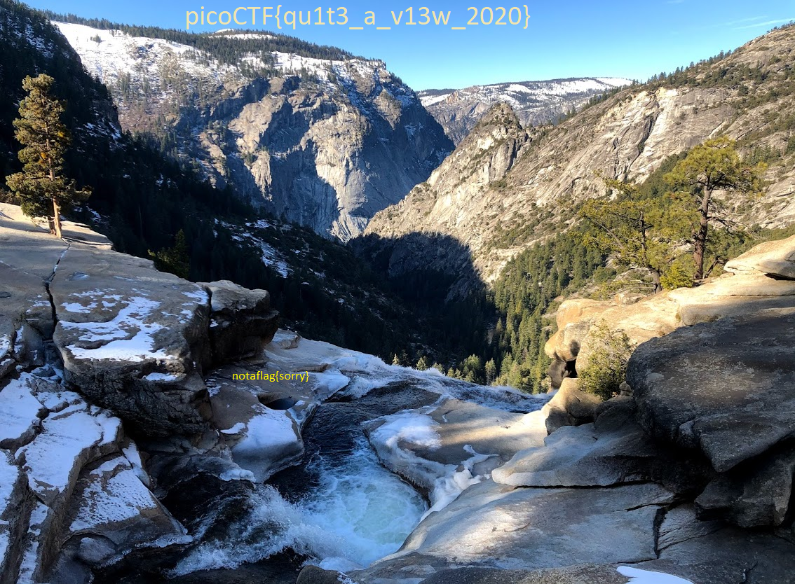
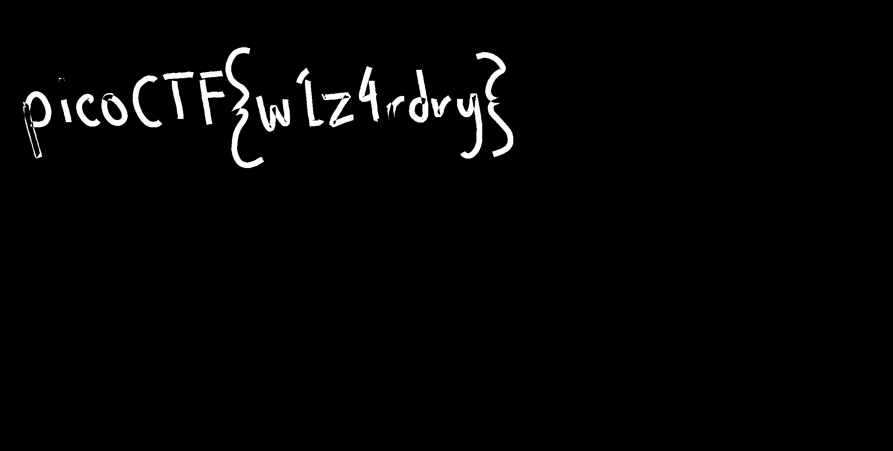
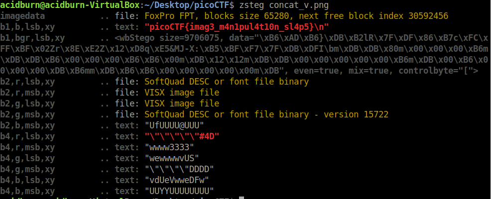
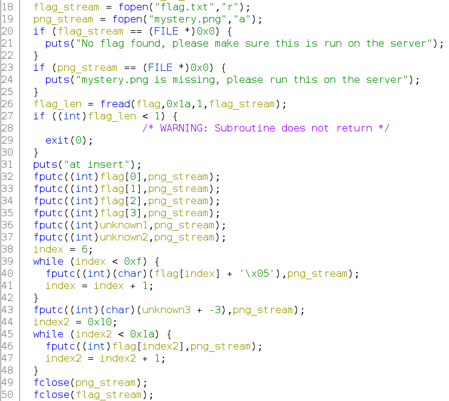

# Forensics
## tunn3l v1s10n  

The given file has no extension and strings or other commands seems not to lead to something useful, so let's try to find a suitable file format through `exiftool`. The result suggest this is a BMP file, and we are quite sure about it by opening it with an hex editor: the magic bytes are correct (42 4d, 'BM') so we will probably need to "fix" this file to obtain the flag.

Let's start to analyze it, and we can soon see two bad00000 patterns, indicating that these are the bytes we need to fix: 

`00000000  42 4d 8e 26 2c 00 00 00  00 00 ba d0 00 00 ba d0  |BM.&,...........|`, so according to BMP files structure we have: 
- 42 4d = _Signature_
- 8e 26 2c 00 = _File size_
- 00 00 = _Reserved 1_
- 00 00 = _Reserved 2_
- ba d0 00 00 = _File Offset to pixel array_
- ba d0 00 00 = _DIB Header Size_

I have no idea of what this means, so let's try to google it and get a better undestanding: from [here](http://www.ece.ualberta.ca/~elliott/ee552/studentAppNotes/2003_w/misc/bmp_file_format/bmp_file_format.htm) we get to know that _DIB Header Size_ turns out to be a constant equal to 40 (0x28), and _File Offset_ the distance from the beginning of the file to the actual image data, so 14 (Header size) + 40 (InfoHeader size) = 54 (0x36), both of them composed of 4 bytes so we need to apply some padding with 00 bytes.

Unfortunately at this point the image is displayed correctly but we are getting trolled, let's keep digging (we know we are on the right way).


After trying some steganography tools on that, by checking again `exiftool` tells us that the image is 1134 x 306 with a size of 2893400. This is pretty suspicious, indicating that maybe this is not the real resolution: we can easily see that by incrementing the height we can see a meaningful higher image and by setting this value as 42 03 we can see the flag.



Flag: **picoCTF{qu1t3_a_v13w_2020}**

## MacroHard WeakEdge  

We are given a Powerpoint file with macros (.pptm), this seems like a "classic" MS Office malware challenge. By opening the file with Powerpoint on Windows I could not see all macros, only a `not_flag() one`, clearly not the flag.

PPTM files use ZIP and XML to compress and organize the data into a single file, so I decided to analyze the file with `binwalk`: after loads of zip archives representing the various slides and their content, two interesting ones are displayed: `ppt/vbaProject.bin` and `ppt/slideMasters/hidden`.

The first one should contain macros, but given that somehow they are hidden I decided to first check the second one. This turns out right, because looking at the `hidden` file we can see `Z m x h Z z o g c G l j b 0 N U R n t E M W R f d V 9 r b j B 3 X 3 B w d H N f c l 9 6 M X A 1 f Q` as result.  
This looks like base64, so removing spaces and decoding it will lead to the flag: 
```bash
cat ppt/slideMasters/hidden | tr -d ' ' | base64 -d
```
Flag: **picoCTF{D1d_u_kn0w_ppts_r_z1p5}**

## Trivial Flag Transfer Protocol   

We are given a .pcap file, by opening it on Wireshark I immediately saw the TFTP protocol, and following the various treams it seems to exchange some files. Remember that ith TFTP we can not encrypt in any way, so we can easily access those files with `File > Export Objects > TFTP`, getting some interesting ones.

The first one is `instructions.txt`, saying: `GSGCQBRFAGRAPELCGBHEGENSSVPFBJRZHFGQVFTHVFRBHESYNTGENAFSRE.SVTHERBHGNJNLGBUVQRGURSYNTNAQVJVYYPURPXONPXSBEGURCYNA`. This seems a rotation cipher (yes, ROT13) actually saying: `TFTPDOESNTENCRYPTOURTRAFFICSOWEMUSTDISGUISEOURFLAGTRANSFER.FIGUREOUTAWAYTOHIDETHEFLAGANDIWILLCHECKBACKFORTHEPLAN`. Plan, huh?

This gets my attention because we have another file `plan`, and by opening it we get `VHFRQGURCEBTENZNAQUVQVGJVGU-QHRQVYVTRAPR.PURPXBHGGURCUBGBF`, again with ROT13 we get `IUSEDTHEPROGRAMANDHIDITWITH-DUEDILIGENCE.CHECKOUTTHEPHOTOS`. 

We still have one `program.deb` and 3 photos, all seems so be right.

At the time of the challenge I had no access to my Linux VM, so I just tried to "decode" the images to see if they contained some sort of steganography. It turns out that the `picture3.bmp` hides the flag, so probably the `program.deb` is a debian package of steghide. 

Using [this](https://futureboy.us/stegano/decinput.html) online tool and the password DUEDILIGENCE i managed to extract the flag: **picoCTF{h1dd3n_1n_pLa1n_51GHT_18375919}**

## Wireshark twoo twooo two twoo...   

We are again given a .pcap, containing a bunch of TCP and HTTP Kerberos conversations. By following the streams I managed to see a flag, but I soon realized it was just a random value put here to trick us. The same happes to a lot of TCP conversations so I just ignored all of them.  
Kerberos conversations are useless too, being encrypted and impossible to read right now: let's focus on the remaining ones, so DNS packets.

There are a lot of DNS requests from 198.168.32.104 to 8.8.8.8 (dns.google) each of them resolved into a strange subdomain, like: `192.168.38.104	dns.google	=>	9NzCwWxd.reddshrimpandherring.com`. This website is obviously not reachable, but the first part seems like base64 (even if decoded makes no sense).  
We can keep analyzing the packets and some of them are not directed to the Google DNS, which seems a way to follow. 

By isolating them with the filter `dns && ip.src==192.168.38.104 && ip.dst!=8.8.8.8` we significantly reduce the number of packets, so this keeps getting better.  
Again we can notice that packets can be grouped 3 by 3, so let's filter them also upon a specific content (present in only 1 of 3 packets of the group) to reduce again the total number (`dns && ip.src==192.168.38.104 && ip.dst!=8.8.8.8  && frame contains "amazon"`).

We now obtain a set of 7 packets, so let's try to decode their base64 part and see what happens. If we take the first packet we get `cGljb0NU`, `picoCT` decoded. BOOM, we got it! Now I continued manually and concatenating everything we obtain the flag: **picoCTF{dns_3xf1l_ftw_deadbeef}**

## advanced-potion-making   

We get an advanced-potion-making file with no extension, so let's run file and see the result: data. Open it with an hex editor and see that we have the PNG file structure: well, this seems to be a corrupted PNG file to fix.

What we can immediately see are the wrong magic bytes, so if we fix them with `89 50 4E 47 0D 0A 1A 0A` we should be done! Well, no. The image is still corrupted, so let's focus on other bytes that could be wrong. If we take a look at the most important chunks and compare them with a uncorrupted PNG file, we can notice that the bytes before IHDL (`IHDL = 49 48 44 52`) are not the same (which are in all "standard" PNG I opened), being `00 12 13 14`.  
Let's fix them, replacing with `00 00 00 0D` and now we can open the image and oh, it's all red.


Luckily, when dealing with forensics challenges and one-coloured images, StegSolve.jar can come in handy: open it and select a Red Mask (also a Random would work in this case) and we can **clearly** see the flag:



Flag: **picoCTF{w1z4rdry}**

## Milkslap   
> http://mercury.picoctf.net:48380/

We are redirected to this cool website where a guy gets slapped. By inspecting the code nothing seems interesting, but when exploring the Sources tab I notice that the background is a series of images all stored in the `concat_v.png` file (I won't post it here because is way too long), and not a gif. Cool, download it and take a look.

Nothing strange seems to be applied to this image, but given the strange type and the challenge category I tried some stego tools. `Binwalk` was clearly drunk, while `steghide` found anything. At this point I tried for the first time `zsteg` with the simple command `zsteg concat_v.png` and this is the result:



Flag: **picoCTF{imag3_m4n1pul4t10n_sl4p5}*

## WhitePages   
> I stopped using YellowPages and moved onto WhitePages... but the page they gave me is all blank!

By opening the given file (a bunch of spaces) and looking at the challenge name I immediately thought about [Whitespace](https://it.wikipedia.org/wiki/Whitespace), but using online editors and interpreters leads to nothing. Even if crazy, Whitespace has a specific logic, using spaces, tabs and new lines: here we have instead just spaces.  
At this point I tried to better analyze the data, and looking closely I saw that only 2 type of spaces were used: a single one and a double one.

Knowing that, the only thing I could think was binary code, so I tried to replace the characters with 0 and 1. The resulting string seems good, so we can try to convert it byte-to-byte into ASCII and see if there is the flag: of course the first try was unsuccessful, so I tried to invert the 0 and 1 correlation with spaces, and finally get the flag. 

Here is the simple Python script I used:
```python
import binascii

SPACE_ONE = " "
SPACE_TWO = "  " 
real_text = ""

f = open("whitepages.txt", "r")
text = f.read()

for c in text:
	if c == SPACE_ONE:
		real_text += '1'
	else:
		real_text += '0'

binary_int = int(real_text, 2)
byte_number = binary_int.bit_length() + 7 // 8

binary_array = binary_int.to_bytes(byte_number, "big")
flag = binary_array.decode()

print(flag)
```

Flag: **picoCTF{not_all_spaces_are_created_equal_7100860b0fa779a5bd8ce29f24f586dc}**

## Investigative Reversing 0   
> We have recovered a binary and an image. See what you can make of it. There should be a flag somewhere.

We are given these two files, so let's take a look at the image (nothing interesting by just opening it) in an hex editor. The first bytes seems ok, but at the very end we can see a strange string: `picoCTKﾀk5zsid6q_3d659f57}` kinda looks like a flag, but not really.

My idea is that the binary file writes something onto the png file, so let's disassemble it and try to see what it really does. If we get to the main function and rewrite its variables in a human readable way, we obtain this:



Actually I think that all the unknown variables are part of the flag, so I will treat them as they are. This because Ghidra is pretty tricky sometimes.
The function does this:
- Reads the flag, 26 (0x1a) characters. Interestingly enough, the string we found is 26 characters long, we are on the right way..
- Appends the first 4 chars of the flag to the image, so _pico_
- Appends two characters that we still don't know, but we can imagine being the 5 and 6 characters of the flag, so _CT_
- Appends the flag characters, from index 6 to 15 (0xf), shifted by +5
- Appends an unknown value (flag[15]) shifted by -3
- From index 16 to 26, the flag is now appended as it is

Knowing that, we can conclude that the last part (`_3d659f57}`) is already correct. To retrieve the first part (excluding `picoCT`) we can just subtract 5 to the ASCII value of every character and print them back: `F{f0und_1`. For the remaining character, just add 3 to it and obtain `t`.

Concatenating everything leads us to the flag: **picoCTF{f0und_1t_3d659f57}**
