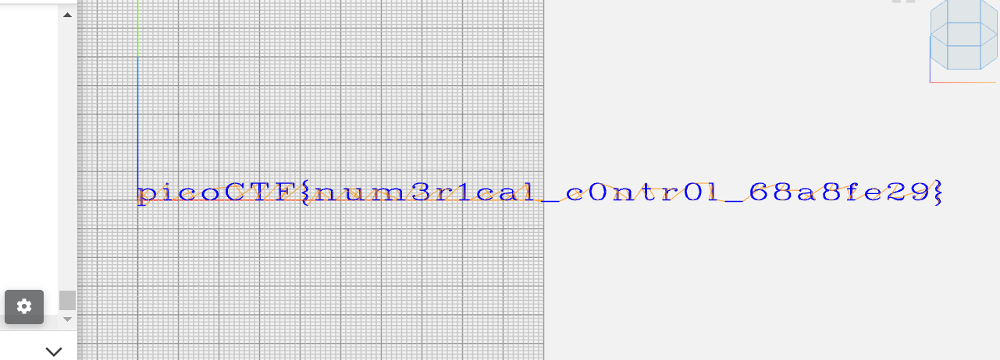
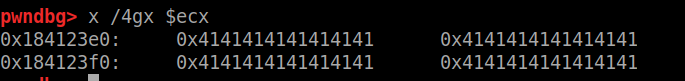
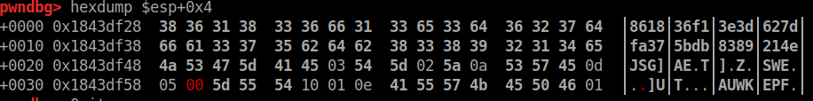
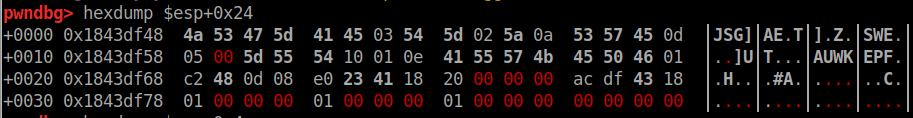

# Reverse Engineering
## ARMssembly 0  

We have a .S file, so let's open it and start analyzing it, knowing that the arguments are 3854998744 and 915131509.  
Here is the main:
```assembly
main:
	stp	x29, x30, [sp, -48]!
	add	x29, sp, 0
	str	x19, [sp, 16]
	str	w0, [x29, 44]
	str	x1, [x29, 32]
	ldr	x0, [x29, 32]
	add	x0, x0, 8
	ldr	x0, [x0]
	bl	atoi
	mov	w19, w0
	ldr	x0, [x29, 32]
	add	x0, x0, 16
	ldr	x0, [x0]
	bl	atoi
	mov	w1, w0
	mov	w0, w19
	bl	func1
	mov	w1, w0
	adrp	x0, .LC0
	add	x0, x0, :lo12:.LC0
	bl	printf
	mov	w0, 0
	ldr	x19, [sp, 16]
	ldp	x29, x30, [sp], 48
	ret
	.size	main, .-main
	.ident	"GCC: (Ubuntu/Linaro 7.5.0-3ubuntu1~18.04) 7.5.0"
	.section	.note.GNU-stack,"",@progbits
```

What the first lines of code seem to do is to read arguments from command line and convert them into integers (notice the double `atoi` link call), and after that we can see `mov    w1, w0` and `mov    w0, w19` leaving the input values in the same order we wrote them: they are then passed to `func1` as parameters with `w0 = 3854998744` and `w1 = 915131509`.  

Here is `func1` and the following functions/labels (`L2`, `L3` and `LC0`): 
```assembly
func1:
	sub	sp, sp, #16
	str	w0, [sp, 12]
	str	w1, [sp, 8]
	ldr	w1, [sp, 12]
	ldr	w0, [sp, 8]
	cmp	w1, w0
	bls	.L2
	ldr	w0, [sp, 12]
	b	.L3
.L2:
	ldr	w0, [sp, 8]
.L3:
	add	sp, sp, 16
	ret
	.size	func1, .-func1
	.section	.rodata
	.align	3
.LC0:
	.string	"Result: %ld\n"
	.text
	.align	2
	.global	main
	.type	main, %function
```

`func1` just loads the two values in reverse order and compares them (now `w0 = 915131509` and `w1 = 3854998744`), if w1 < w0 then jumps to `.L2`: this is not our case. Then the `ldr   w0, [sp, 12]` instruction will load the first value, 3854998744, and jump to `.L3`.

After getting back to the main, this value will be printed. The challenge description says that the flag format is the hex value of what will be printed, so **picoCTF{e5c69cd8}**

## Speeds and feeds  

We connect to a remote server and we get as result a veeeery long output, let's write it on a file and take a look. We can immediately see every lines starts with G, and then X/Y/Z and some numerical values: this is G-Code, used by 3D printers (luckily enough I already solved a G-Code challenge).

We can then paste the code on [this](https://ncviewer.com/) Simulator and view the result: 


Flag: **picoCTF{num3r1cal_c0ntr0l_68a8fe29}**

## ARMssembly 1   

This challenge is very similar to ARMssembly 0, so we can use the same approach.  
Here is the main:
```assembly
main:
	stp	x29, x30, [sp, -48]!
	add	x29, sp, 0
	str	w0, [x29, 28]
	str	x1, [x29, 16]
	ldr	x0, [x29, 16]
	add	x0, x0, 8
	ldr	x0, [x0]
	bl	atoi
	str	w0, [x29, 44]
	ldr	w0, [x29, 44]
	bl	func
	cmp	w0, 0
	bne	.L4
	adrp	x0, .LC0
	add	x0, x0, :lo12:.LC0
	bl	puts
	b	.L6
```

The `bne    .L4` is what we want to avoid, because it will lead to `.LC1` printing "You Lose :(". We want instead not to take that branch and jump to `.LC0` printing "You Win!": we need w0 = 0 (the result of `func`).
```assembly
func:
	sub	sp, sp, #32
	str	w0, [sp, 12]	; this is the needed argument, call it x
	mov	w0, 58
	str	w0, [sp, 16]	; store 58 
	mov	w0, 2
	str	w0, [sp, 20]	; store 2
	mov	w0, 3
	str	w0, [sp, 24]	; store 3
	ldr	w0, [sp, 20]	; w0 = 2
	ldr	w1, [sp, 16]	; w1 = 58
	lsl	w0, w1, w0	; w0 = 58 << 2 = 58 * 4 = 232
	str	w0, [sp, 28]	; store 232
	ldr	w1, [sp, 28]	; w1 = 232
	ldr	w0, [sp, 24]	; w0 = 3
	sdiv	w0, w1, w0	; w0 = 232 / 3
	str	w0, [sp, 28]	; store 77
	ldr	w1, [sp, 28]	; w1 = 77
	ldr	w0, [sp, 12]	; w0 = x
	sub	w0, w1, w0	; w0 = 77 - x
	str	w0, [sp, 28]	; store (77 - x)
	ldr	w0, [sp, 28]	; w0 = (77 - x)
	add	sp, sp, 32
	ret
	.size	func, .-func
	.section	.rodata
	.align	3
```

The comments I added to the assembly code are self-explanatory, in this case we have that (77 - x) must be equal to 0, leading to `x = 77`. 77 in hex is 4d, thus the flag (lowercase and 8 bit) will be **picoCTF{0000004d}**

## ARMssembly 2  

ARMssembly again, same process with argument 1748687564. Notice that `wrz` is a special register containing value 0.
```assembly
func1:
	sub	sp, sp, #32
	str	w0, [sp, 12]	; store 1748687564
	str	wzr, [sp, 24]	; store 0
	str	wzr, [sp, 28]	; store 0
	b	.L2
.L3:
	ldr	w0, [sp, 24]	; w0 = 0,3,.. 
	add	w0, w0, 3	; w0 = 3,6,..
	str	w0, [sp, 24]	; store 3,6,.. until 1748687564 * 3
	ldr	w0, [sp, 28]	; w0 = 0,1,..
	add	w0, w0, 1	; w0 = 1,2,..
	str	w0, [sp, 28]	; store 1,2,..
.L2:
	ldr	w1, [sp, 28]	; w1 = 0,1,2,.. until 1748687564
	ldr	w0, [sp, 12]	; w0 = 1748687564,same,same
	cmp	w1, w0		
	bcc	.L3		; carry is clear so jump
	ldr	w0, [sp, 24]	; w0 = [sp + 24]
	add	sp, sp, 32
	ret
	.size	func1, .-func1
	.section	.rodata
	.align	3
```

`func1` is easy, just store values and jump to `.L2` that will load [sp + 28] (initially 0) and [sp + 12] (initially our input) and compare them before jumping to `.L3` with a `bcc` instruction. After googling it I found out that `BCC is Branch on Carry Clear`, and the Carry flag is usually cleared when the result is “higher than or equal”: this actually means that we jump if w1 < w0, we ignore the jump otherwise.  
Looking at how the code is written we can conclude that this is a loop start, executing `.L3` and then again `.L2` until `bcc`, the loop exit condition.

As we can see from the comments I made, at each iteration the [sp + 24] value is incremented by 3 and the [sp + 28] value is incremented by 1, while [sp + 12] remains the same. If we look at the loop from an higher level, we can conclude that the first one is the modified variable, the second one is the index of the loop, and the third one is the loop limiter. 

At the end of the loop, executed 1748687564 times, we will end up with 1748687564 * 3 stored in [sp + 24], which is the value returned by `.L2` and then printed by the `main`.

If we rewrite the result (5246062692) following the required flag format we get 138b09064, but this is not a 32 bit number (9 bits)! Just AND it with 0xffffffff and obtain the flag: **picoCTF{38b09064}**

## Hurry up! Wait!  

We get a .exe file, so let's download it and disassemble it with Ghidra. It's stripped, so we can search the `entry` function to get the `libc_start_main` calling `FUN_00101fcc`, let's rename it as `main` and go on with the analysis.

Here we can see 3 functions calls (FUN_00101d7c, FUN_0010298a, FUN_00101d52) but if we dig into them we can conclude that the first one is an initialization function and the third "closes" a string with '\0', so we should focus on the second one, call it `print_flag`:


As we can see there are a lot of calls to other functions, but there is no point on renaming them. Just by opening and analyzing the first two, they access local data corresponding to 70 and 69 respectively: converting them into ASCII, they are 'p' and 'i'... seems like pico!  
Now we can continue in the same way (remember Alt + left_arrow to go back in disassemble) and get:
`70 69 63 6f 43 54 46 7b 64 31 35 61 35 6d 5f 66 74 77 5f 30 65 37 34 63 64 34 7d`

Converting these bytes into ASCII and get the flag: **picoCTF{d15a5m_ftw_0e74cd4}**

## gogo  

We are given an executable and nothing more, if we try to execute it or to connect to the server we are asked for a password: let's open that in `Ghidra` and see some disassembled code.

By looking at the main (a bit confused) we can see an interesting checkPassword method, let's ignore all the weird instructions and focus on relevant ones. The only thing we can obtain from this is that the password is 0x20 (32) characters long, and the loop will check character by character our input XORed with an unknown char, comparing it with an expected one.

Now it's better to explore the behaviour with `gdb` writing down an interesting address to set the breakpoint at, like `0x080d4b08`, the initialization of the index variable. After running it with password made of 32 "A"s and breaking (`b *0x080d4b08`) we can now see the actual assembly instructions performed, here are the most relevant:
```assembly
   0x80d4b18 <main.checkPassword+152>:	movzx  ebp,BYTE PTR [ecx+eax*1]			; see #1 
   0x80d4b1c <main.checkPassword+156>:	cmp    eax,0x20					; correct = 32?
   0x80d4b1f <main.checkPassword+159>:	jae    0x80d4b66 <main.checkPassword+230>	; if yes, got it
   0x80d4b21 <main.checkPassword+161>:	movzx  esi,BYTE PTR [esp+eax*1+0x4]		; see #2
   0x80d4b26 <main.checkPassword+166>:	xor    ebp,esi					; see #3
   0x80d4b28 <main.checkPassword+168>:	movzx  esi,BYTE PTR [esp+eax*1+0x24]		; see #4
   0x80d4b2d <main.checkPassword+173>:	xchg   ebp,eax					; switch values
   0x80d4b2e <main.checkPassword+174>:	xchg   esi,ebx					; switch values
   0x80d4b30 <main.checkPassword+176>:	cmp    al,bl					; AL is the lower 8 bits of EAX, same for BL
   0x80d4b32 <main.checkPassword+178>:	xchg   esi,ebx					; switch back
   0x80d4b34 <main.checkPassword+180>:	xchg   ebp,eax					; switch back
   0x80d4b35 <main.checkPassword+181>:	jne    0x80d4b0e <main.checkPassword+142>	; if not equal, go back to loop
   0x80d4b37 <main.checkPassword+183>:	inc    ebx					; if equal, correct+1 and
   0x80d4b38 <main.checkPassword+184>:	jmp    0x80d4b0e <main.checkPassword+142>	; go back to loop
```

From this we get that:
- **#1**: by looking at registers value we see `eax = 0`, this means that `ebp` is set to the content of `ecx`: if we look at it with `x /4gx $ecx` we can see that it contains our input. Thus, we store our input in `ebp`


- **#2**: again `eax = 0`, so `esi` is set to the content of `esp + 0x4`: if we look at it with `x /4gx $esp + 0x4` we can see that it contains some values, the ones we will use to XOR our input


- **#3**: performs the actual XOR and stores the result in `ebp`, in fact with our input (0x41) and the actual value of `esi` (0x38) we observe `ebp = 0x79`
- **#4**: again we store in esi the value of `esp + 0x24`: if we look at it with `x /4gx $esp + 0x24` we can see that it contains some values, the expected ones (because later we compare THIS value to the XOR result)


Now we know everything we need to revert the operation by XORing the two retreived byte sequences and get the password (bytes order must be inverted w.r.t. previous screenshots):
```python
>>> xor_values = 0x3836313833366631336533643632376466613337356264623833383932313465
>>> exp_values = 0x4a53475d414503545d025a0a5357450d05005d555410010e4155574b45504601
>>> pwd = hex(xor_values^exp_values)
>>> print(pwd)
0x72657665727365656e67696e6565726963616e626172656c79666f7277617264
>>> print(bytes.fromhex(pwd[2:]))
b'reverseengineericanbarelyforward'
```

Boom! Let's put it as password aaaaandd..... another question: _What is the unhashed key?_  
I think nothing relevant is left in the source code, so this must be a value we already found.. also they are talking about a key, so maybe is the numbers we used to XOR the password with? If we take the ASCII representation of `xor_values we` have `861836f13e3d627dfa375bdb8389214e`. This is the MD5 hash of **goldfish**.

After sending this we get the flag: **picoCTF{p1kap1ka_p1c001b3038b}**

## vault-door 6  

I skipped the first 5 vault-door challeges on purpose because they are just converting/encoding stuff, from now on they should be a little bit more challenging.  
We can take a look at the source and we immediately see this check password method:
```java
public boolean checkPassword(String password) {
        if (password.length() != 32) {
            return false;
        }
        byte[] passBytes = password.getBytes();
        byte[] myBytes = {
            0x3b, 0x65, 0x21, 0xa , 0x38, 0x0 , 0x36, 0x1d,
            0xa , 0x3d, 0x61, 0x27, 0x11, 0x66, 0x27, 0xa ,
            0x21, 0x1d, 0x61, 0x3b, 0xa , 0x2d, 0x65, 0x27,
            0xa , 0x66, 0x36, 0x30, 0x67, 0x6c, 0x64, 0x6c,
        };
        for (int i=0; i<32; i++) {
            if (((passBytes[i] ^ 0x55) - myBytes[i]) != 0) {
                return false;
            }
        }
        return true;
    }

```

So the password is 32 chars, and to obtain it we can simply reverse the comparison performed in the for loop for every character. This is the very simple Python script I used: 
```python
myBytes = [
            0x3b, 0x65, 0x21, 0xa , 0x38, 0x0 , 0x36, 0x1d,
            0xa , 0x3d, 0x61, 0x27, 0x11, 0x66, 0x27, 0xa ,
            0x21, 0x1d, 0x61, 0x3b, 0xa , 0x2d, 0x65, 0x27,
            0xa , 0x66, 0x36, 0x30, 0x67, 0x6c, 0x64, 0x6c,
]

'''
flag[i] ^ 0x55 = myBytes[i]
flag[i] = myBytes[i] ^ 0x55
'''

flag = list()

for b in myBytes:
	flag.append(chr(b ^ 0x55))
flag = "".join(flag)

print(flag)
```

Flag: **picoCTF{n0t_mUcH_h4rD3r_tH4n_x0r_3ce2919}**

## vault-door 7  

We can take a look at the source and we immediately see this check password method, clearly explained with comments:
```java
    // Each character can be represented as a byte value using its
    // ASCII encoding. Each byte contains 8 bits, and an int contains
    // 32 bits, so we can "pack" 4 bytes into a single int. Here's an
    // example: if the hex string is "01ab", then those can be
    // represented as the bytes {0x30, 0x31, 0x61, 0x62}. When those
    // bytes are represented as binary, they are:
    //
    // 0x30: 00110000
    // 0x31: 00110001
    // 0x61: 01100001
    // 0x62: 01100010
    //
    // If we put those 4 binary numbers end to end, we end up with 32
    // bits that can be interpreted as an int.
    //
    // 00110000001100010110000101100010 -> 808542562
    //
    // Since 4 chars can be represented as 1 int, the 32 character password can
    // be represented as an array of 8 ints.
```

So what we have to do is to reverse all this algorithm, given the int arrays: `int -> binary (32 bits) -> split 4 x 8 bits -> hex -> ASCII`. This is the very simple Python script I used: 
```python
int_list = [1096770097, 1952395366, 1600270708, 1601398833, 1716808014, 1734293296, 842413104, 1684157793]

flag = ""

for i in int_list:
	bin_32 = ((bin(i)[2:]).zfill(32))
	binaries=[bin_32[i:i+8] for i in range(0, 32, 8)]

	for b in binaries:
		hex_value = hex(int(b,2))
		ascii_value = bytes.fromhex(hex_value[2:]).decode("ASCII")
		flag += ascii_value

print("picoCTF{"+flag+"}")
```

Flag: **picoCTF{A_b1t_0f_b1t_sh1fTiNg_702640db5a}**

## vault-door 8  

After rewriting a bit the ugly code they gave us, we can now see two important methods: 
```java
// These pesky special agents keep reverse engineering our source code and then
// breaking into our secret vaults. THIS will teach those sneaky sneaks a
// lesson.
//
// -Minion #0891
import java.util.*;
import javax.crypto.Cipher;
import javax.crypto.spec.SecretKeySpec;
import java.security.*;
class VaultDoor8 {
 public static void main(String args[]) {
  Scanner b = new Scanner(System.in);
  System.out.print("Enter vault password: ");
  String c = b.next();
  String f = c.substring(8, c.length() - 1);
  VaultDoor8 a = new VaultDoor8();
  if (a.checkPassword(f)) {
   System.out.println("Access granted.");
  } else {
   System.out.println("Access denied!");
  }
 }
 public char[] scramble(String password) {
  /* Scramble a password by transposing pairs of bits. */
  char[] a = password.toCharArray();
  for (int b = 0; b < a.length; b++) {
   char c = a[b];
   c = switchBits(c, 1, 2);
   c = switchBits(c, 0, 3); /* c = switchBits(c,14,3); c = switchBits(c, 2, 0); */
   c = switchBits(c, 5, 6);
   c = switchBits(c, 4, 7);
   c = switchBits(c, 0, 1); /* d = switchBits(d, 4, 5); e = switchBits(e, 5, 6); */
   c = switchBits(c, 3, 4);
   c = switchBits(c, 2, 5);
   c = switchBits(c, 6, 7);
   a[b] = c;
  }
  return a;
 }
 public char switchBits(char c, int p1, int p2) {
  /* Move the bit in position p1 to position p2, and move the bit
  that was in position p2 to position p1. Precondition: p1 < p2 */
  char mask1 = (char)(1 << p1);
  char mask2 = (char)(1 << p2); /* char mask3 = (char)(1<<p1<<p2); mask1++; mask1--; */
  char bit1 = (char)(c & mask1);
  char bit2 = (char)(c & mask2);
  /* System.out.println("bit1 " + Integer.toBinaryString(bit1));
System.out.println("bit2 " + Integer.toBinaryString(bit2)); */
  char rest = (char)(c & ~(mask1 | mask2));
  char shift = (char)(p2 - p1);
  char result = (char)((bit1 << shift) | (bit2 >> shift) | rest);
  return result;
 }
 public boolean checkPassword(String password) {
  char[] scrambled = scramble(password);
  char[] expected = {
   0xF4,
   0xC0,
   0x97,
   0xF0,
   0x77,
   0x97,
   0xC0,
   0xE4,
   0xF0,
   0x77,
   0xA4,
   0xD0,
   0xC5,
   0x77,
   0xF4,
   0x86,
   0xD0,
   0xA5,
   0x45,
   0x96,
   0x27,
   0xB5,
   0x77,
   0x94,
   0x85,
   0xC0,
   0xA5,
   0xC0,
   0xB4,
   0xC2,
   0xF0,
   0xF0
  };
  return Arrays.equals(scrambled, expected);
 }
}
```

- `scramble`, takes the password and switches chars at index: 1-2, 0-3, 5-6, 4-7, 0-1, 3-4, 2-5, 6-7
- `switchBits`, actually switches the bits in the given positions

The only thing we need to do now is to reverse the algorithm by inverting the order in which the chars are scrambled, so 6-7, 2-5, ...  
By doing that in an online Java IDE we obtain `s0m3_m0r3_b1t_sh1fTiNg_ad0f0c833`, that's the flag we needed.

Flag: **picoCTF{s0m3_m0r3_b1t_sh1fTiNg_ad0f0c833}**
